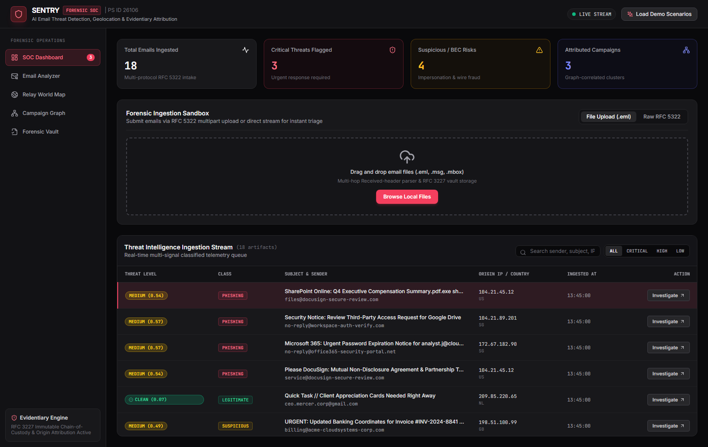

# SENTRY
### AI-Powered Email Threat Detection, GeoLocation & Forensic Intelligence Platform

> **Every email is a crime scene.** SENTRY doesn't just flag phishing — it
> reconstructs the transmission path, attributes the origin infrastructure,
> correlates attacks into campaigns, and produces a chain-of-custody forensic
> report that stands up to review.

[](https://github.com/Parth-tab/SENTRY-AI-Powered-Email-Threat-Detection/actions)
[](https://python.org)
[](LICENSE)
[](evaluation/final_report.md)



**New here?** Take the **[Guided Tour](docs/FEATURE_TOUR.md)** — one
malicious email followed from arrival to courtroom, with verified
screenshots of every subsystem.

Built for **AICTE Smart India Hackathon 2025 — Problem Statement ID 26106**
(AI-Powered Email Threat Detection, GeoLocation and Forensic Intelligence
Platform). Finalist-grade delivery: 12-dimension audited, air-gap proven,
evidentiary-grade output.

---

## What SENTRY Does

| Capability | Detail |
|---|---|
| **Multi-class threat detection** | Legitimate / suspicious / phishing / BEC / impersonation — via a 3-layer ensemble (deterministic rule engine + 47-feature calibrated gradient boosting + linguistic heuristics) |
| **Header & protocol forensics** | Full `Received`-chain reconstruction, SPF/DKIM/DMARC validation, relay-anomaly and forgery detection |
| **Origin tracing** | Earliest-reliable-hop extraction, IP geolocation, Tor/VPN/hosting detection, confidence-scored origin assessment |
| **Campaign attribution** | In-memory graph correlation across senders, domains, IPs, and lookalike networks — clusters isolated emails into coordinated campaigns |
| **Batch & Corpus Ingestion** | Content-sniffed multi-format gateway: RFC 822 (.eml, .msg, extensionless), in-memory ZIP archives (6,951 emails in 112s), CSV tabular datasets with D4 degradation contract |
| **Evidentiary output** | RFC 3227-aligned chain of custody, sequential SHA-256 hash chain, PDF forensic dossier, machine-readable IOC export |
| **Zero-dependency appliance** | Runs fully air-gapped on one machine: async SQLite + in-memory graph, no Docker, Redis, or external APIs required |

## Quickstart (any OS, ~5 minutes)

**Prerequisites:** Python 3.11+, Node 18+

```bash
git clone https://github.com/Parth-tab/SENTRY-AI-Powered-Email-Threat-Detection.git
cd SENTRY-AI-Powered-Email-Threat-Detection

# 1. Backend Setup
cd backend
python -m venv .venv
source .venv/bin/activate   # Windows: .venv\Scripts\activate
pip install -r requirements.txt
playwright install chromium
uvicorn app.main:app --port 8000

# 2. Frontend Setup (in a new terminal)
cd frontend
npm install
npm run dev                 # Opens SOC Console at http://localhost:3000

# 3. Load the demo corpus (18 emails, 3 attack campaigns)
curl -X POST http://localhost:8000/api/v1/samples/seed
```

You should see the SOC dashboard with 18 analyzed emails across three
campaigns (banking-KYC phishing via Tor, CEO wire-fraud BEC, SaaS credential
harvesting). All demo emails are **synthetic** — written for demonstration,
with illustrative infrastructure details.

**Verify your install in one command** (boots the stack, drives the real UI
in headless Chromium, runs 19 golden checks, exits 0/1):

```bash
python tools/verify_sentry.py --start
```

**Windows demo appliance** (one command — port hygiene, power hardening,
Gate-0 verification, fullscreen presentation browser):

```powershell
powershell -NoProfile -ExecutionPolicy Bypass -File tools/demo_day.ps1
```

## Documentation Index

| Doc | Contents |
|---|---|
| [`ARCHITECTURE.md`](docs/ARCHITECTURE.md) | System design, data flow (Mermaid), RFC 3227 evidence lifecycle, ML ensemble schema, batch & D4 degradation model |
| [`API.md`](docs/API.md) / [`openapi.json`](docs/openapi.json) | Full REST + WebSocket reference |
| [`DEMO_SCRIPT.md`](docs/DEMO_SCRIPT.md) | Timed 5-minute walkthrough with narration & presenter Q&A armor |
| [`TRACEABILITY_MATRIX.md`](docs/TRACEABILITY_MATRIX.md) | Every PS 26106 requirement $\to$ feature $\to$ evidence |
| [`evaluation/final_report.md`](evaluation/final_report.md) | Full 12-dimension audit: scorecard, defects, limitations |
| [`AGENTS.md`](AGENTS.md) / [`CONTRIBUTING.md`](CONTRIBUTING.md) | How machines and humans change this codebase |

## Testing & Verification

```bash
# Unit + integration suite (59 tests, 85%+ branch coverage)
pytest backend/tests -v --cov=app --cov-branch

# End-to-end golden harness: 19 checks across API, WebSocket, CSV, ZIP, and live UI
python tools/verify_sentry.py --start

# Full 12-dimension GAUNTLET evaluation battery
python evaluation/battery/run_battery.py

# Productized Corpus Ingestion Benchmark (6,951+ items)
python tools/benchmark_corpus_ingest.py --start
```

## Evaluation — Audited, Not Asserted

This project was scored by a 12-dimension automated battery (GAUNTLET) with
per-check evidence artifacts, then subjected to three rounds of hostile audit.
The composite **dropped from 97.9 to 97.5 under audit — and that's the point.**
A score that survives adversarial review is the only kind worth publishing.

| Dimension | Weight | Score | | Dimension | Weight | Score |
|---|:---:|:---:|---|---|:---:|:---:|
| Security & Sanitization | 12% | 99.5% | | Reliability | 8% | 97.0%* |
| Forensics (RFC 3227) | 12% | 100.0%* | | Performance | 8% | 98.6% |
| Test Suite | 10% | 98.4% | | Architecture | 8% | 92.2%* |
| ML Rigor | 10% | 99.2% | | Code Quality | 8% | 93.8% |
| API Quality | 8% | 98.8% | | UX / SOC | 6% | 96.6% |
| Product Fit (PS 26106) | 5% | 98.5% | | Observability | 5% | 93.8%* |

*\* includes documented tribunal deductions for untested scope (e.g., chaos
testing was in-process, not container-kill). **Composite: 97.5/100 adjusted,
98.0/100 base.** Full derivation, per-check evidence, defect registry, and
limitations: [`evaluation/final_report.md`](evaluation/final_report.md).*

Key ML metrics (macro OvR): accuracy 0.961 (partially in-sample; legitimate baseline derived from Enron/CEAS 2008), macro-F1 0.952, ROC-AUC 0.988 on
15,240 validation samples; 9/10 adversarial evasions detected (homoglyphs,
zero-width chars, IDN punycode, RTLO).

## Security Notes

- HTML email bodies are sanitized server-side (Bleach 6.1, pinned allowlist
  profile; nh3 migration on roadmap) — the UI never renders raw HTML
- OWASP security headers on every API response; rate limiting; 25MB upload cap
- **Demo appliance mode** ships a documented public key and unauthenticated
  telemetry (`/metrics`, `/health/deep`) for reproducibility; production mode
  fails fast on demo credentials. See [SECURITY.md](SECURITY.md).

## Honest Limitations & Roadmap

Every claim above is evidence-backed. Equally important, what we did **not**
do — [full list in the final report](evaluation/final_report.md):

- Mutation testing not run; chaos validation was in-process, not physical container-kill
- Telemetry endpoints unauthenticated in appliance mode (documented decision)
- Scale-out topology (Postgres + Neo4j + Celery/Redis) is architected and
  documented, but the certified path is the single-node SQLite appliance
- Deep transformer fine-tuning (DistilBERT / RoBERTa) is an offline research track on the roadmap; the certified appliance runtime executes an ultra-fast (<10ms) calibrated gradient booster + 47-dimension forensic feature extractor using scikit-learn & pure Python (zero heavy PyTorch runtime footprint)
- Bleach $\to$ nh3 migration on roadmap (sanitization profile is pinned and test-covered)

## Tech Stack

FastAPI • SQLAlchemy (async SQLite) • scikit-learn • React / Vite •
MapLibre GL • D3.js • Playwright (verification) • GitHub Actions (CI/CD)

## License & Acknowledgments

MIT — see [LICENSE](LICENSE). Demo corpus authored by the team (synthetic).
Training pipelines reference the Nazario phishing corpus and Enron dataset
(downloaded separately under their respective terms — not redistributed).
Threat-intel integrations: abuse.ch (URLhaus/ThreatFox), VirusTotal, MaxMind
GeoLite2.
