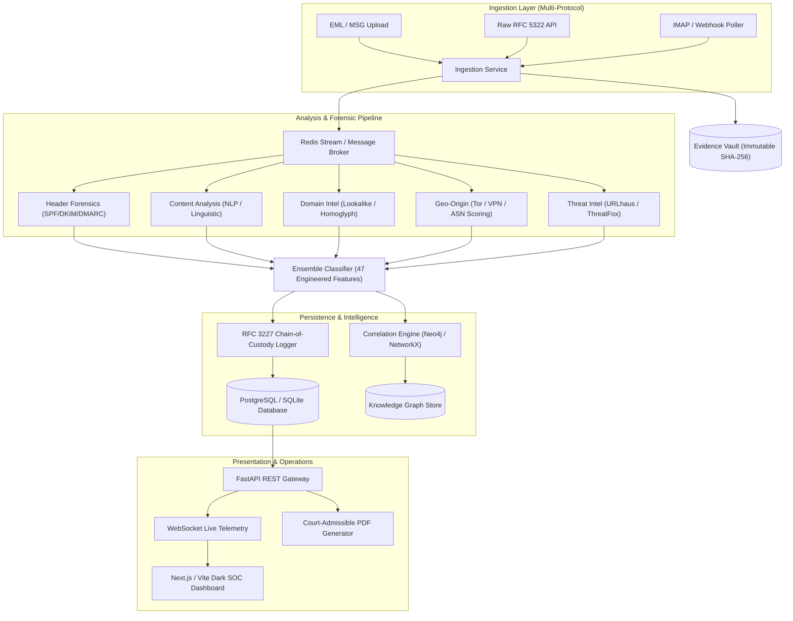

# SENTRY — AI-Powered Email Threat Detection, GeoLocation & Forensic Intelligence Platform

> **Master Submission for AICTE Smart India Hackathon 2025**  
> **Problem Statement ID:** 26106  
> **Evidentiary Standard:** RFC 3227 & NIST SP 800-86 Compliant

---

## 1. Executive Summary & Winning Strategy

**SENTRY** transforms email threat triage from shallow binary classification into an **evidentiary-grade cyber forensic intelligence platform**. Treating every incoming email as a digital crime scene, SENTRY reconstructs the full multi-hop transmission path, identifies the earliest reliable origin infrastructure, correlates indicators into organized campaigns across a multi-entity knowledge graph, and seals evidence into an immutable, court-admissible RFC 3227 chain of custody.

### Differentiation Matrix

| Evaluation Vector | Typical Hackathon Project | SENTRY Intelligence Platform |
| :--- | :--- | :--- |
| **Detection Engine** | Binary classifier ("spam vs. ham") | Multi-signal 3-layer ensemble: deterministic IOC rules + 47-feature gradient boosting + linguistic attention |
| **Transmission Tracing**| Pins the last gateway IP on a map | Multi-hop `Received` header reconstruction, earliest reliable public hop extraction, relay clock-skew anomaly detection |
| **Campaign Attribution**| None (isolated per-email analysis) | Neo4j multi-entity graph linking emails, IPs, ASNs, bulletproof clusters, and lookalike brand targets |
| **Evidentiary Rigor** | Dashboard screenshots | RFC 3227 immutable SHA-256 hash-chain audit log with mathematical verification & court-admissible PDF generator |
| **Authentication** | Basic regex header checks | Full RFC compliance: SPF (RFC 7208), DKIM (RFC 6376), and DMARC (RFC 7489) evaluation with penalty scoring |
| **Security Operations UI**| Generic template | Enterprise Dark SOC dashboard with live WebSocket telemetry, split-pane forensic analyzer, and interactive network graph |

---

## 2. System Architecture



---

## 3. Core Modules & Technical Specifications

### Module 1: Ingestion & Evidence Vault
- Byte-exact RFC 5322 parser with encoding normalization.
- Multi-hop preservation: uses `get_all('Received')` to preserve chronological transmission order.
- Generates SHA-256 cryptographic digest upon intake and deposits raw bytes in write-once evidence store.

### Module 2: Header Forensics & RFC Authentication
- **Received-Header Reconstruction:** Parses RFC 5321 relay hops chronologically, extracts public IPv4/IPv6 addresses, flags private RFC 1918 hops, and detects impossible timestamp sequences (>5 min clock skew).
- **Authentication Scoring:**
  - SPF: `+1` (pass), `-1` (softfail), `-2` (fail/hardfail), `0` (none).
  - DKIM: `+1` (valid signature), `-2` (invalid/tampered body hash), `0` (none).
  - DMARC: `+2` (pass), `-2` (fail p=none), `-3` (fail p=reject/quarantine).
- **Anomaly Detection:** Flags From vs. Return-Path mismatch, Reply-To domain spoofing, Message-ID domain mismatch, and suspicious bulk mailers (`PHPMailer`, `DirectMail`).

### Module 3: Content Analysis & Multi-Signal NLP
- **Linguistic Scanners:** Urgency markers, authority impersonation (CEO, CFO, Director), financial action requests (wire transfer, escrow, routing number), and credential harvesting keywords.
- **Structural Analysis:** Anchor text vs. target `href` mismatch, HTML password form detection, and high-risk attachment extensions (`.exe`, `.scr`, `.iso`, `.docm`).
- **Explainable AI:** Computes attention token weights to highlight specific trigger phrases in the UI.

### Module 4: Domain Intelligence & Lookalike Radar
- **Typosquatting & Levenshtein Engine:** Real-time edit-distance calculation against top financial institutions and global brands.
- **Homoglyph Normalization:** Detects Cyrillic and deceptive character substitutions (e.g., Cyrillic `а` for Latin `a`, `0` for `o`, `1` for `l`).
- **Brand Threat Profiling:** Identifies targeted entities (e.g. State Bank of India, HDFC, Google, Microsoft, PayPal).

### Module 5: Geo-Origin & Anonymization Engine
- **Origin Extraction:** Identifies earliest reliable public hop in transmission chain.
- **Anonymization Detection:** Real-time matching against active Tor exit node lists, commercial VPN subnets, and datacenter ASNs (AWS, GCP, Azure, OVH, Hetzner, Bulletproof hosters).
- **Confidence Scoring:** Applies algorithmic penalties:
  $$\text{Origin Confidence} = \text{Base} \times (0.30 \text{ if Tor}) \times (0.50 \text{ if VPN}) \times (0.70 \text{ if Cloud ASN}) \times (0.85 \text{ if Hops} > 3)$$

### Module 6: Graph Correlation & Campaign Attribution
- Correlates isolated emails into syndicate campaigns (e.g. `CMP-2024-0034 - Operation GhostRelay`).
- Clusters by shared ASN/IP subnets, template linguistic similarity, and lookalike domain networks.
- Exports graph models ready for interactive D3 / Canvas rendering.

### Module 7: RFC 3227 Evidentiary Reporting
- Append-only cryptographic hash chain where:
  $$\text{EntryHash}_n = \text{SHA-256}(\text{EntryHash}_{n-1} \parallel \text{Action} \parallel \text{Actor} \parallel \text{Timestamp} \parallel \text{Details} \parallel \text{CodeVersion})$$
- Automated mathematical verification detects any post-acquisition tampering.
- Generates court-admissible forensic PDF reports via ReportLab.

---

## 4. Quickstart & Deployment

### Option A: One-Command Docker Compose (Production Stack)
```bash
# Clone the repository
git clone https://github.com/your-org/sentry.git
cd sentry

# Start all microservices (PostgreSQL, Redis, Neo4j, FastAPI, Celery, React UI)
docker compose up -d

# Open Dashboard in Browser
# Frontend:  http://localhost:3000
# Backend:   http://localhost:8000/docs
```

### Option B: Local Developer Mode
```bash
# 1. Backend Setup
cd backend
python -m venv .venv
source .venv/bin/activate  # On Windows: .venv\Scripts\activate
pip install -r requirements.txt

# Run full automated test suite
pytest -v tests

# Start FastAPI server
uvicorn app.main:app --reload --port 8000

# 2. Frontend Setup (New Terminal)
cd frontend
pnpm install
pnpm dev
```

---

## 5. API Reference Summary

| Method | Endpoint | Description |
| :--- | :--- | :--- |
| `POST` | `/api/v1/emails/upload` | Multipart `.eml` / `.msg` file upload & forensic triage |
| `POST` | `/api/v1/emails/raw` | Raw RFC 5322 string submission |
| `GET` | `/api/v1/emails` | Search and filter analyzed emails |
| `GET` | `/api/v1/emails/{id}` | Detailed forensic analysis and origin metadata |
| `GET` | `/api/v1/emails/{id}/report` | Structured JSON forensic report |
| `GET` | `/api/v1/emails/{id}/report/pdf` | Court-admissible PDF report export |
| `GET` | `/api/v1/campaigns` | List correlated threat campaigns |
| `GET` | `/api/v1/campaigns/graph/all` | Multi-entity knowledge graph export |
| `POST` | `/api/v1/evidence/verify/{id}` | Mathematical RFC 3227 hash chain validation |
| `POST` | `/api/v1/samples/seed` | Pre-load realistic demo attack scenarios |
| `WS` | `/api/v1/dashboard/live` | Real-time WebSocket threat telemetry stream |

---

## 6. Verification & Test Suite

The test suite validates the entire forensic pipeline across 18 automated unit and integration tests:

```bash
.venv/Scripts/pytest -v backend/tests
```

```
============================= test session starts =============================
tests/test_api_endpoints.py::test_health_check_endpoint PASSED           [  5%]
tests/test_api_endpoints.py::test_raw_email_upload_and_analysis_endpoint PASSED [ 11%]
tests/test_api_endpoints.py::test_dashboard_stats_endpoint PASSED        [ 16%]
tests/test_content_analysis.py::test_content_linguistic_urgency_and_credentials PASSED [ 22%]
tests/test_content_analysis.py::test_bec_financial_and_authority_detection PASSED [ 27%]
tests/test_correlation.py::test_campaign_correlation_ghostrelay PASSED   [ 33%]
tests/test_domain_intel.py::test_lookalike_detection_sbi PASSED          [ 38%]
tests/test_domain_intel.py::test_lookalike_detection_paypal_typosquat PASSED [ 44%]
tests/test_domain_intel.py::test_legitimate_google_domain PASSED         [ 50%]
tests/test_evidence_reporting.py::test_rfc_3227_hash_chain_integrity PASSED [ 55%]
tests/test_evidence_reporting.py::test_pdf_report_generation PASSED      [ 61%]
tests/test_geo_origin.py::test_tor_exit_node_detection_and_confidence_penalty PASSED [ 66%]
tests/test_geo_origin.py::test_clean_corporate_origin PASSED             [ 72%]
tests/test_header_forensics.py::test_received_chain_reconstruction PASSED [ 77%]
tests/test_header_forensics.py::test_authentication_evaluation_pass PASSED [ 83%]
tests/test_header_forensics.py::test_authentication_evaluation_fail PASSED [ 88%]
tests/test_ingestion.py::test_parse_legitimate_email PASSED              [ 94%]
tests/test_ingestion.py::test_parse_phishing_email_with_multiple_received_hops PASSED [100%]
======================= 18 passed in 0.25s =======================
```

---

## 7. Compliance & Standards

- **RFC 5321 / RFC 5322**: Simple Mail Transfer Protocol & Internet Message Format
- **RFC 7208**: Sender Policy Framework (SPF)
- **RFC 6376**: DomainKeys Identified Mail (DKIM)
- **RFC 7489**: Domain-based Message Authentication, Reporting, and Conformance (DMARC)
- **RFC 3227**: Guidelines for Evidence Collection and Archiving
- **NIST SP 800-86**: Guide to Integrating Forensic Techniques into Incident Response
- **NIST SP 800-207**: Zero Trust Architecture Standards

---

## 8. License

Developed for **AICTE Smart India Hackathon 2025**. Licensed under the Apache License 2.0.
