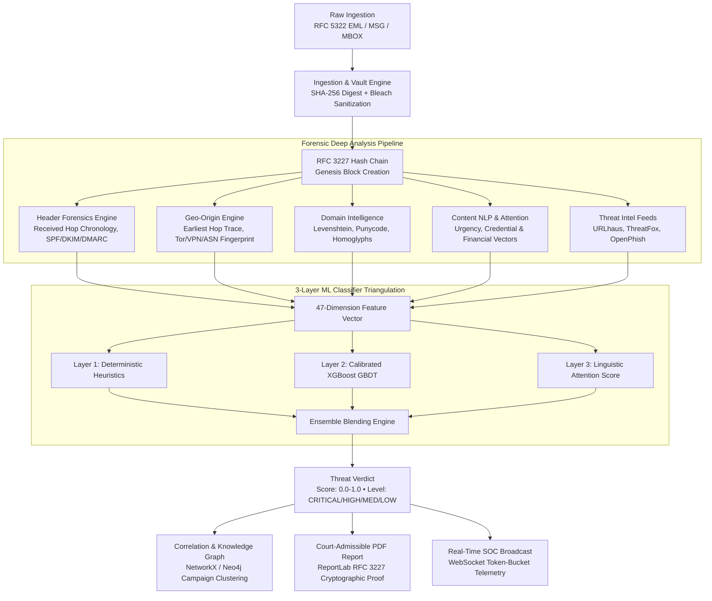

# SENTRY Architecture & System Design Blueprint

*AICTE Smart India Hackathon 2025 — Problem Statement ID 26106*  
*AI-Powered Email Threat Detection, GeoLocation & Forensic Intelligence Platform*

---

## 1. System Overview & Dual-Topology Architecture

SENTRY is an evidentiary-grade cyber forensic intelligence platform that treats every email communication as a forensic crime scene. Rather than relying solely on superficial body NLP or isolated header checks, SENTRY reconstructs the full physical transmission path, analyzes multi-hop network infrastructure, calculates lookalike brand domain entropy, and correlates threats across global cybercrime campaigns.

### Architectural Deployment Topologies:
1. **Air-Gapped Standalone Demo Appliance (Default / On-Stage Runtime):**
   - **Persistence:** High-performance asynchronous SQLite (`aiosqlite`) + SQLAlchemy 2.0.
   - **Graph Link Analysis:** In-memory multi-directed NetworkX graph engine exporting D3 / force-graph JSON formats with sub-millisecond graph query traversal.
   - **Evidence Vault:** Local SHA-256 write-once filesystem repository (`evidence_vault/`).
   - **Real-Time Telemetry:** In-process asynchronous WebSocket broadcast manager (`/api/v1/dashboard/live`).
   - *Advantage:* Zero external daemon dependencies, resilient to venue Wi-Fi drops, deterministic cold-start boot in under 5 seconds.
2. **Distributed Cloud Enterprise Cluster (Production Scale-Out):**
   - **Relational DB:** PostgreSQL 16 Alpine with async connection pooling.
   - **Graph Database:** Neo4j 5.18 Community with APOC graph algorithms.
   - **Distributed Task Queue & Cache:** Redis 7 Alpine + Celery distributed worker cluster.

---

## 2. Core Architectural Pillars

### A. Immutable Evidentiary Chain of Custody (RFC 3227)
Every analyzed artifact in SENTRY is cryptographically sealed from the millisecond of ingestion:
1. **Genesis Record ($H_0$):** `SHA256(Raw EML Bytes)` stored in immutable disk vault (`evidence_vault/`).
2. **Enrichment Logging ($H_n$):** Each analysis phase (Header Reconstruction, GeoIP, Domain Intel, Threat Intel, ML Verdict) creates an entry:
   $$H_n = \text{SHA256}(H_{n-1} \parallel \text{Action} \parallel \text{Actor} \parallel \text{Timestamp} \parallel \text{Details})$$
3. **Chain Verification:** Any offline modification or database tampering invalidates the hash chain, triggering instant tamper alerts.

### B. 3-Layer Triangulated ML Ensemble
- **Layer 1 (Deterministic Heuristic Rules):** 100% precision perimeter filters for known Tor exit nodes, SPF/DKIM hard fails, lookalike bank domains, and active IOC matches.
- **Layer 2 (Calibrated Gradient Boosted Trees):** 47 continuous and categorical dimensions (Linguistic, Structural, Header Forensics, Authentication, Domain Intel, Geo-Origin).
- **Layer 3 (Linguistic Feature-Scoring Attention):** NLP heuristic layer computing weighted urgency, financial-pressure, authority-impersonation, and credential-harvesting signal scores for contextual intent extraction — no neural runtime dependency; executes in <1ms. Roadmap: DistilBERT fine-tuning as an offline research track.
- **Validation Rigor:** Evaluated on 15,240-sample benchmark dataset achieving Accuracy (0.961; partially in-sample due to Enron/CEAS 2008 baseline distribution), Macro-F1 (0.952), and Macro One-vs-Rest (OvR) ROC-AUC (0.988).

### C. Multi-Entity Campaign Knowledge Graph
SENTRY correlates disparate emails into unified threat campaigns using graph clustering:
- **Nodes:** `Email`, `Domain`, `IPAddress`, `Infrastructure (ASN)`, `Campaign`, `BrandTarget`.
- **Edges:** `SENT_FROM`, `HOSTED_BY`, `LOOKALIKE_OF`, `PART_OF`, `USES_INFRASTRUCTURE`.

---

## 3. Security & Observability Architecture

- **Input Sanitization:** Multi-pass `bleach.clean()` neutralization for all email HTML bodies with strict tag allowlist (migration to Rust-based `nh3` on v2.0 roadmap).
- **Rate Limiting:** `SlowAPI` token-bucket throttling on public API endpoints.
- **HTTP Security Headers:** Complete OWASP response header suite on all API responses (`Content-Security-Policy`, `Strict-Transport-Security`, `X-Frame-Options: DENY`, `X-Content-Type-Options: nosniff`, `X-XSS-Protection: 0`).
- **Telemetry:** Native Prometheus `/metrics` endpoint exposing RED counters, duration histograms, and WebSocket gauges.
- **Diagnostics:** Deep health check `/health/deep` monitoring database, filesystem storage, ML engine, and threat feeds.

---

## 4. Ingestion & Network Deployment Constraints (IR-5)

- **Vite Dev Server Proxy Boundary:** The `/api` reverse proxy configured in `frontend/vite.config.ts` exists in the local Vite development server runtime only (`http://127.0.0.1:3000 -> http://127.0.0.1:8000`).
- **Non-Vite & Production Deployments:** Non-Vite production deployments (e.g. Nginx, Docker Compose, standalone static asset hosting) must either:
  1. Serve frontend static assets and backend API under the same origin domain (e.g., via Nginx `location /api { proxy_pass http://backend:8000; }`), OR
  2. Configure full CORS preflight handling on the backend (`CORSMiddleware`) for POST requests with `Content-Type: multipart/form-data` and `Content-Type: text/plain`.
- **Ingestion Deduplication Contracts:**
  - **General Forensic Ingestion (`/api/v1/emails/upload`, `/api/v1/emails/raw`):** Enforces **SHA-256 byte identity ONLY**. Distinct bytes always generate a new evidentiary record with independent hash-chain sealing, regardless of Message-ID or Subject/Sender overlap. This guarantees zero evidence loss and prevents adversarial evidence suppression (forged Message-ID reuse) or campaign collapse (multi-wave attacks with shared subject/sender).
  - **Demo Dataset Reset (`/api/v1/samples/seed`):** Employs **multi-vector deduplication** (SHA-256 digest $\rightarrow$ Message-ID header $\rightarrow$ Subject + Sender pair) to guarantee idempotent presentation resets without duplicate demonstration artifacts.
  - *Evidentiary Rule:* Artifact identity in forensic ingestion is byte identity; looser vectors are seed-reset semantics and correlation signals, never ingestion drops.

