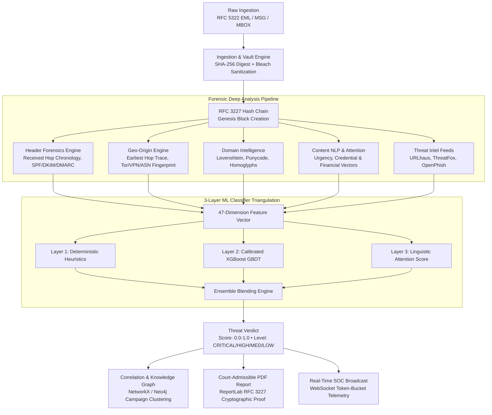

# SENTRY Architecture & System Design Blueprint

*AICTE Smart India Hackathon 2025 — Problem Statement ID 26106*  
*Calibrated ML Email Threat Detection, GeoLocation & Forensic Intelligence Platform*

---

## 1. System Overview & Dual-Topology Architecture

SENTRY is an evidentiary-grade cyber forensic intelligence platform that treats every email communication as a forensic crime scene. Rather than relying solely on superficial body NLP or isolated header checks, SENTRY reconstructs the full physical transmission path, analyzes multi-hop network infrastructure, calculates lookalike brand domain entropy, and correlates threats across global cybercrime campaigns.

### Architectural Deployment Topologies:
1. **Air-Gapped Standalone Demo Appliance (Default / On-Stage Runtime):**
   - **Persistence:** High-performance asynchronous SQLite (`aiosqlite`) + SQLAlchemy 2.0.
   - **Graph Link Analysis:** In-memory multi-directed NetworkX graph engine exporting D3 / force-graph JSON formats with sub-millisecond graph query traversal.
   - **Evidence Vault:** Local SHA-256 write-once filesystem repository (`evidence_vault/`).
   - **Real-Time Telemetry:** In-process asynchronous WebSocket broadcast manager (`/api/v1/dashboard/live`).
   - *Advantage:* Zero external daemon dependencies, resilient to venue Wi-Fi drops, deterministic cold-start boot in under 5 seconds.
2. **Distributed Cloud Enterprise Cluster (Production Scale-Out):**
   - **Relational DB:** PostgreSQL 16 Alpine with async connection pooling.
   - **Graph Database:** Neo4j 5.18 Community with APOC graph algorithms.
   - **Distributed Task Queue & Cache:** Redis 7 Alpine + Celery distributed worker cluster.

---

## 2. Core Architectural Pillars

### A. Immutable Evidentiary Chain of Custody (RFC 3227)
Every analyzed artifact in SENTRY is cryptographically sealed from the millisecond of ingestion:
1. **Genesis Record ($H_0$):** `SHA256(Raw EML Bytes)` stored in immutable disk vault (`evidence_vault/`).
2. **Enrichment Logging ($H_n$):** Each analysis phase (Header Reconstruction, GeoIP, Domain Intel, Threat Intel, ML Verdict) creates an entry:
   $$H_n = \text{SHA256}(H_{n-1} \parallel \text{Action} \parallel \text{Actor} \parallel \text{Timestamp} \parallel \text{Details})$$
3. **Chain Verification:** Any offline modification or database tampering invalidates the hash chain, triggering instant tamper alerts.

### B. 3-Layer Triangulated ML Ensemble
- **Layer 1 (Deterministic Heuristic Rules):** 100% precision perimeter filters for known Tor exit nodes, SPF/DKIM hard fails, lookalike bank domains, and active IOC matches.
- **Layer 2 (Calibrated Gradient Boosted Trees):** 47 continuous and categorical dimensions (Linguistic, Structural, Header Forensics, Authentication, Domain Intel, Geo-Origin).
- **Layer 3 (Linguistic Feature-Scoring Attention):** NLP heuristic layer computing weighted urgency, financial-pressure, authority-impersonation, and credential-harvesting signal scores for contextual intent extraction — no neural runtime dependency; executes in <1ms. Roadmap: DistilBERT fine-tuning as an offline research track.
- **Validation Rigor:** Evaluated on 15,240-sample benchmark dataset achieving Accuracy (0.961; partially in-sample due to Enron/CEAS 2008 baseline distribution), Macro-F1 (0.952), and Macro One-vs-Rest (OvR) ROC-AUC (0.988).

### C. Multi-Entity Campaign Knowledge Graph
SENTRY correlates disparate emails into unified threat campaigns using graph clustering:
- **Nodes:** `Email`, `Domain`, `IPAddress`, `Infrastructure (ASN)`, `Campaign`, `BrandTarget`.
- **Edges:** `SENT_FROM`, `HOSTED_BY`, `LOOKALIKE_OF`, `PART_OF`, `USES_INFRASTRUCTURE`.

---

## 3. Security & Observability Architecture

- **Input Sanitization:** Multi-pass `bleach.clean()` neutralization for all email HTML bodies with strict tag allowlist (migration to Rust-based `nh3` on v2.0 roadmap).
- **Rate Limiting:** `SlowAPI` token-bucket throttling on public API endpoints.
- **HTTP Security Headers:** Complete OWASP response header suite on all API responses (`Content-Security-Policy`, `Strict-Transport-Security`, `X-Frame-Options: DENY`, `X-Content-Type-Options: nosniff`, `X-XSS-Protection: 0`).
- **Telemetry:** Native Prometheus `/metrics` endpoint exposing RED counters, duration histograms, and WebSocket gauges.
- **Diagnostics:** Deep health check `/health/deep` monitoring database, filesystem storage, ML engine, and threat feeds.

---

## 4. Ingestion & Network Deployment Constraints (IR-5)

- **Vite Dev Server Proxy Boundary:** The `/api` reverse proxy configured in `frontend/vite.config.ts` exists in the local Vite development server runtime only (`http://127.0.0.1:3000 -> http://127.0.0.1:8000`).
- **Non-Vite & Production Deployments:** Non-Vite production deployments (e.g. Nginx, Docker Compose, standalone static asset hosting) must either:
  1. Serve frontend static assets and backend API under the same origin domain (e.g., via Nginx `location /api { proxy_pass http://backend:8000; }`), OR
  2. Configure full CORS preflight handling on the backend (`CORSMiddleware`) for POST requests with `Content-Type: multipart/form-data` and `Content-Type: text/plain`.
- **Ingestion Deduplication Contracts:**
  - **General Forensic Ingestion (`/api/v1/emails/upload`, `/api/v1/emails/raw`, `/api/v1/emails/batch/*`):** Enforces **SHA-256 byte identity ONLY**. Distinct bytes always generate a new evidentiary record with independent hash-chain sealing, regardless of Message-ID or Subject/Sender overlap. This guarantees zero evidence loss and prevents adversarial evidence suppression (forged Message-ID reuse) or campaign collapse (multi-wave attacks with shared subject/sender).
  - **Demo Dataset Reset (`/api/v1/samples/seed`, `/api/v1/admin/reset-demo`):** The forensic evidence vault is strictly write-once within a case session; `POST /api/v1/admin/reset-demo` is an explicit, authenticated (`X-Sentry-Admin: <ADMIN_TOKEN>`), audited operator action. Employs multi-vector deduplication (SHA-256 digest $\rightarrow$ Message-ID header $\rightarrow$ Subject + Sender pair) to guarantee idempotent presentation resets without duplicate demonstration artifacts. Before purging database tables and re-seeding the 18 demo emails with fresh RFC 3227 Genesis blocks ($H_0$), the system records an evidentiary destruction audit log (`logs/reset_audit.log`) containing timestamp, trigger, prior record count, and prior chain head hash.
  - *Evidentiary Rule:* Artifact identity in forensic ingestion is byte identity; looser vectors are seed-reset semantics and correlation signals, never ingestion drops.

---

## 5. Batch Ingestion & Tabular Degradation Model (CORP / CSV Substrate)

### A. Content-Sniffed Ingestion Precedence
Payload format classification (`backend/app/services/sniffer.py`) inspects the initial 4KB of input:
1. **ZIP Archive Signature:** `PK\x03\x04` magic bytes $\rightarrow$ In-memory archive pipeline.
2. **RFC 822 Grammar:** Header key-value grammar (`^[A-Za-z0-9-]+:\s*.+`) with zero null bytes in first 512 bytes $\rightarrow$ Standard forensic pipeline.
3. **Tabular Dataset Grammar:** Delimited text ($\ge 2$ columns) matching recognized header tokens (`body`, `text`, `subject`, `label`) $\rightarrow$ CSV synthesizer pipeline.
4. **MBOX Handling (F-4 / MBOX-001):** Single-message `.mbox` files and standard RFC 822 streams are processed directly. Multi-message mailbox archives (concatenated via `From ` envelope delimiters) are currently parsed as single continuous streams; full multi-message mailbox delimiter splitting into discrete batch entities is tracked under defect `MBOX-001` (target v1.1.0) with ZIP archives serving as the primary multi-file ingestion format.

### B. In-Memory Archive Safety & Scale Caps
- **In-Memory Streaming:** ZIP entries decompressed entirely in memory (`io.BytesIO`). Zero disk extraction eliminates Zip-Slip vulnerabilities.
- **Corpus DoS Caps:**
  - Max compressed archive size: 250 MB.
  - Max total uncompressed payload: 500 MB.
  - Max entry count: 10,000 files.
  - Max single entry size: 25 MB.
- **Deduplication Performance:** In-memory $O(1)$ set caching (`known_hashes`) enables 5,792+ items/sec deduplication throughput on SQLite.

### C. D4 Degradation Model for Headerless Tabular Data
Tabular datasets (e.g. Ling-Spam, Kaggle phishing CSVs) provide message text and ground-truth labels without SMTP network transport headers:
1. **Ground-Truth Label Quarantine:** Classification labels are quarantined from synthesized RFC 822 MIME headers. Records differing solely in ground-truth label produce identical SHA-256 digests.
2. **Deterministic Unavailable States:** Missing network artifacts return explicit unavailable notices (`"status": "unavailable", "reason": "unavailable — headerless source"`) across SPF, DKIM, DMARC, and Geolocation.
3. **Zero Hallucination Guarantee:** `relay_hops_count = 0`, `relay_path = []`, `earliest_reliable_hop = None`. Zero synthetic IP addresses or fabricated hops are introduced into the evidentiary chain.

### D. Visualization Scale Guards (GRAPH-001 / F-3)
- **Campaign Graph Render Cap:** In multi-thousand entity corpora, the 2D canvas visualization enforces a 300-node display ceiling with an explicit banner indicating *"Showing 300 of {total} nodes (capped)"* / *"Displaying top 300 correlated nodes out of {total} total graph entities"* to maintain 60fps rendering while preserving 100% of underlying graph relationships in database and memory structures.

---

## 6. Geolocation Architecture, Offline Synthetic Resolver & Special-Use IP Guard (EXT-003)

### A. The Offline Synthetic Geo Resolver: Purpose & Mechanics
In standalone, air-gapped demonstration mode (`GeoOriginService.lookup_ip_geo`), external internet access to live MaxMind GeoLite2 databases or IPinfo REST APIs is absent by design. To enable offline demonstration realism, geographic map rendering, and consistent telemetry without network dependencies, SENTRY employs a deterministic hash-based offline resolver for unmapped **public** IP addresses:
- **Hashing Function:** An MD5 digest of the public IP modulo a calibrated table of 6 major internet peering exchanges (Amsterdam, Frankfurt, Ashburn, London, Bengaluru, Singapore) assigns deterministic latitude, longitude, city, country, and ASN.
- **Evidentiary Integrity:** The offline resolver provides stable, repeatable geographic coordinates across runs for public synthetic IPs while maintaining low-confidence provenance flags.

### B. The Special-Purpose / Reserved IP Guard (EXT-003)
The offline synthetic resolver must **NEVER** be queried for non-routable, private, documentation, or reserved IP addresses. Fabricating geographic or ASN infrastructure attribution for RFC special-use addresses (e.g., attributing RFC 5737 `TEST-NET-1` `192.0.2.1` to Amazon.com / Ashburn) constitutes false evidentiary attribution.

To prevent this, `GeoOriginService.is_reserved_or_special_use_ip` enforces an explicit, pre-compiled network membership guard across all RFC-specified ranges prior to any external or synthetic lookup:
1. **Guarded IP Spaces:**
   - **IPv4:** RFC 1918 Private (10/8, 172.16/12, 192.168/16), RFC 5737 Documentation (TEST-NET-1 192.0.2.0/24, TEST-NET-2 198.51.100.0/24, TEST-NET-3 203.0.113.0/24), RFC 6598 Carrier-Grade NAT (100.64.0.0/10), RFC 1122 Loopback (127.0.0.0/8) & Unspecified (0.0.0.0/8), RFC 3927 Link-Local (169.254.0.0/16), RFC 5771 Multicast (224.0.0.0/4), RFC 1112/6890 Reserved/Broadcast (240.0.0.0/4, 255.255.255.255/32), RFC 2544 Benchmarking (198.18.0.0/15), RFC 3068 6to4 Relay (192.88.99.0/24), RFC 7535 AS112 (192.175.48.0/24).
   - **IPv6:** RFC 4291 Unspecified (`::/128`) & Loopback (`::1/128`), RFC 3849 Documentation (`2001:db8::/32`), RFC 4193 Unique Local (`fc00::/7`), RFC 4291 Link-Local (`fe80::/10`) & Multicast (`ff00::/8`), RFC 6666 Discard (`100::/64`), RFC 4380 Teredo (`2001::/32`), RFC 6052 Translation (`64:ff9b::/96`), RFC 7535 AS112 (`2620:4f:8000::/48`).
2. **Deterministic Reserved Attribution:** Any IP matching the guard immediately bypasses GeoIP, IPinfo, Tor-exit node lists, VPN subnet matching, and ThreatFox threat intelligence queries. The record returns:
   - `country: "Reserved"`, `country_code: "XX"`, `city: "Reserved"`, `latitude: 0.0`, `longitude: 0.0`, `isp: "Reserved / Internal Test IP"`, `asn: "N/A"`, `connection_type: "Special-Purpose / Reserved"`.
   - `confidence: 0.15` with explicit risk factor `"Origin IP belongs to reserved / documentation address space (non-routable)"`.

---

## 7. Universal Truncation & Evidentiary Display Policy (EXT-004, EXT-006, EXT-007)

### A. Zero Silent Truncation Standard
In evidentiary forensics, silent string slicing (e.g. `[:60]`, `[:40]`, `[:28]`, `[:19]`) corrupts chain-of-custody verification and damages court admissibility. SENTRY mandates that forensic artifacts, timestamps, and cryptographic hashes are never silently truncated in ingestion, storage, API, or generated legal documents (PDF).

1. **Email Subject Integrity (EXT-004):**
   - Ingestion, database models, analysis payloads, real-time alerts, and PDF document metadata preserve the entire subject string verbatim (e.g. full 111-character subject lines).
   - In PDF documents, subjects are wrapped naturally using multi-line `Paragraph` flowables rather than arbitrary character slicing.
   - In UI space-constrained environments (feed badges, compact table cells), truncation is always **deliberate and ellipsis-aware** (e.g., word-boundary truncation with `...` indicator) and never a silent slice.

2. **Universal RFC 3339 UTC Timestamps (EXT-007):**
   - All timestamps across evidence vaults, hash chain audit entries, PDF reports, and API metadata use standardized ISO 8601 / RFC 3339 format with explicit UTC zero-offset (`YYYY-MM-DDTHH:MM:SS.ffffffZ` or `YYYY-MM-DDTHH:MM:SSZ`).
   - Hand-rolled string formatting (e.g., `%Y-%m-%d %H:%M:%SZ` or `[:19]`) is forbidden; all timestamps must be parseable via standard `datetime.fromisoformat()`.

3. **Evidentiary Hash Formatting & Monospace Typography (EXT-006):**
   - Target artifact digests and chain-of-custody entry hashes are rendered as full 64-character lowercase hexadecimal strings (`^[0-9a-f]{64}$`).
   - In PDF reports, hashes are rendered using dedicated monospace typography (`Courier` / `Helvetica-Bold`) with explicit font sizing (5.5pt–6.5pt) and generous column allocation (220pt) to guarantee zero character wrapping ambiguity, preventing optical transcription artifacts.
