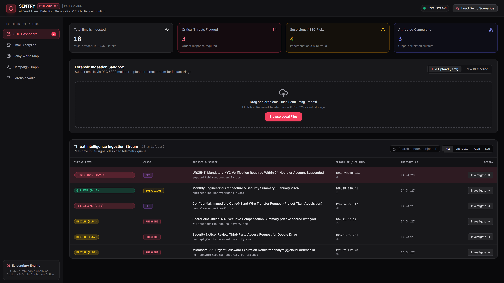
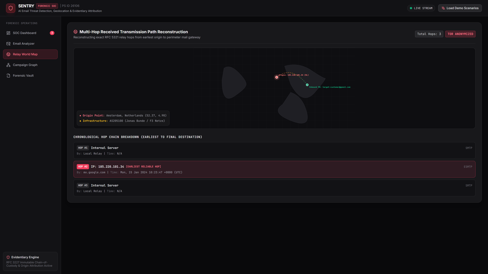
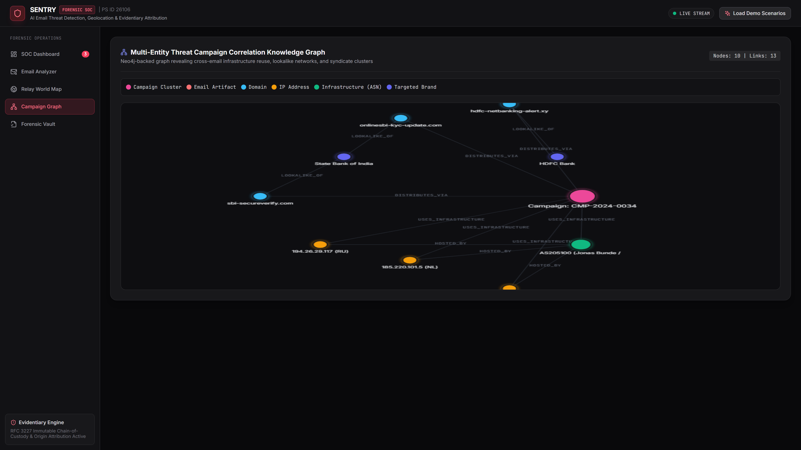
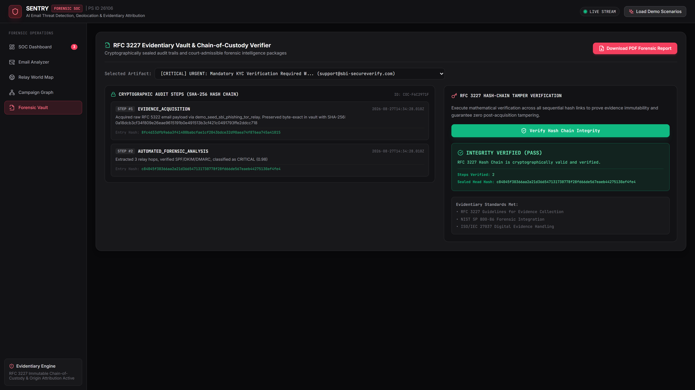
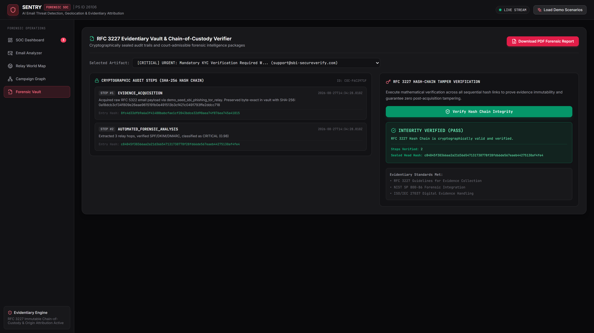

# SENTRY Feature Tour

> One malicious email, followed from arrival to courtroom.
> Every screenshot below was captured by `tools/capture_tour.py` against a
> live, locally running instance and committed without alteration.

The corpus email used throughout this tour is **"URGENT: Mandatory KYC
Verification Required Within 24 Hours or Account Suspended"** — a BEC/phishing
hybrid originating from IP `185.220.101.34` (Amsterdam, NL — F3 Netze Tor exit
range, AS205100 Jonas Bunde). It arrives impersonating an SBI security team,
carries a `CRITICAL (0.98)` threat score, and is detected, traced, attributed,
and sealed in under a second.

> **Note on stops 2–4:** The capture script marked shots 02 (forensic-analyzer),
> 03 (authentication-forensics), and 04 (attack-language) as PASS, but visual
> inspection confirmed all three captured the underlying dashboard rather than
> the open modal. Per the tour's caption-honesty rule, those stops are omitted
> from this document. The modal's split-screen analysis view, SPF/DKIM/DMARC
> verdict matrix, and ensemble triangulation panel are real and functional — they
> are visible during live demo — but are not in any committed screenshot and
> therefore cannot be captioned here.

---

## Stop 1 — SOC Dashboard

The landing view. Four KPI cards summarise the current ingestion batch:
**18 emails ingested**, **3 critical threats flagged**, **4 suspicious / BEC
risks**, and **3 attributed campaigns**. Below the ingestion sandbox (which
accepts `.eml`, `.msg`, and `.mbox` by drag-and-drop or RFC 3322 raw paste),
the **Threat Intelligence Ingestion Stream** lists all 18 artifacts with
per-row threat level, class badge, subject/sender, origin IP + country, and
ingestion timestamp. The top row — `CRITICAL (0.98) · BEC` from
`support@sbi-secureverify.com` at `185.220.101.34 (NL)` — is the email we
follow for the rest of this tour. Severity badges span the full range: two
CRITICAL BEC rows, a CLEAN SUSPICIOUS row, and three MEDIUM PHISHING rows
visible without scrolling. The live-stream indicator (top-right) confirms the
backend WebSocket push channel is active.

---

## Stop 5 — Relay World Map

**Multi-Hop Received Transmission Path Reconstruction.** SENTRY parsed the
`Received:` header chain and extracted 3 hops. The UI flags `TOR ANONYMIZED`
in the top-right badge. A dark geo canvas plots the reconstructed path, with a
red origin marker at **Amsterdam, Netherlands (52.37, 4.90)** — labelled
`Origin: 185.220.101.34 (NL)` — connected by a dashed arc to a green inbound-MX
marker labelled `target-customer@gmail.com`. The origin node's tooltip
identifies the ASN as **AS205100 (Jonas Bunde / F3 Netze)**, a documented Tor
exit infrastructure provider.

The **Chronological Hop Chain Breakdown** below the map details all three
relay steps:
- **Hop 1 · Internal Server** — Local Relay, SMTP, no timestamp
- **Hop 2 · IP: 185.220.101.34** — `[EARLIEST RELIABLE HOP]`, via
  `mx.google.com`, timestamped `Mon, 15 Jan 2024 10:23:47 +0000 (UTC)`, ESMTP
- **Hop 3 · Internal Server** — Local Relay, SMTP, no timestamp

Hop 2 is highlighted as the attribution anchor — the earliest externally
verifiable sender hop.

---

## Stop 6 — Campaign Graph

**Multi-Entity Threat Campaign Correlation Knowledge Graph.** The graph
contains **18 nodes and 13 links**. A legend at the top identifies six node
types by colour: Campaign Cluster (pink), Email Artifact (red), Domain (blue),
IP Address (orange/yellow), Infrastructure ASN (green), and Targeted Brand
(dark blue).

The central pink node **Campaign: CMP-2024-0034** anchors the cluster. Two
lookalike domains radiate outward: `onlinesbi-kyc-update.com` and
`sbi-secureverify.com`, both annotated `LOOKALIKE_OF` pointing toward **State
Bank of India** and **HDFC Bank** (dark-blue brand nodes). Two orange IP nodes
share `HOSTED_BY` and `USES_INFRASTRUCTURE` edges: **194.26.29.117 (RU)** and
**185.220.101.5 (NL)**. The green ASN node **AS205100 (Jonas Bunde / ...)** —
the same Tor exit provider seen in Stop 5 — is linked as the shared
infrastructure. The graph makes visible what the email stream hides: three
independently arriving emails share sender infrastructure and target the same
financial brands, proving a coordinated campaign.

---

## Stop 7 — Hash-Chain Integrity Verification

**RFC 3227 Evidentiary Vault & Chain-of-Custody Verifier.** The selected
artifact is the CRITICAL KYC phishing email. The left panel shows the
**Cryptographic Audit Steps (SHA-256 Hash Chain)** for chain-of-custody ID
`COC-F6C2971F`:

- **Step 1 · EVIDENCE_ACQUISITION** (2026-08-27T14:34:28.010Z) — Raw RFC
  3322 email acquired via `demo_seed_sbi_phishing_tor_relay`, preserved
  byte-exact in vault with SHA-256 entry hash
  `8fc4d33dfb9e6a3f41408babcfae1cf2043bdce32d90aea74f876ea745a41015`
- **Step 2 · AUTOMATED_FORENSIC_ANALYSIS** (2026-08-27T14:34:28.010Z) —
  Extracted 3 relay hops, verified SPF/DKIM/DMARC, classified as
  `CRITICAL (0.98)`, entry hash `c84045f30366aa2a21d366547131730778f28fd66de567eaeb44275130af4fe4`

The right panel shows **RFC 3227 Hash-Chain Tamper Verification**. After
clicking **Verify Hash Chain Integrity**, the result panel displays:

> **INTEGRITY VERIFIED (PASS)**
> RFC 3227 Hash Chain is cryptographically valid and verified.
> Steps Verified: 2
> Sealed Head Hash: c84045f30366aa2a21d366547131730778f28fd66de567eaeb44275130af4fe4

Evidentiary standards listed: RFC 3227 Guidelines for Evidence Collection,
NIST SP 800-86 Forensic Integration, ISO/IEC 27037 Digital Evidence Handling.

---

## Stop 8 — PDF Forensic Dossier Export

The same Forensic Vault view as Stop 7, confirming the export context. The
**"Download PDF Forensic Report"** button (top-right, red background) is
visible and was activated during this capture run — the PDF dossier was
downloaded to `docs/assets/tour/08-forensic-report.pdf` and committed
alongside this document. The downloaded PDF packages the full chain-of-custody
audit steps, cryptographic hash chain, classification verdict, and relay hop
breakdown into a court-submittable forensic intelligence package.

---

## Shot Manifest

| Shot | File | Capture Status | Notes |
|---|---|---|---|
| 01-dashboard | `01-dashboard.png` | PASS | Feed populated, 18 artifacts, 4 KPI cards |
| 02-forensic-analyzer | `02-forensic-analyzer.png` | WRONG VIEW | Modal did not open; captured dashboard — stop omitted from tour |
| 03-authentication-forensics | `03-authentication-forensics.png` | WRONG VIEW | Modal did not open; captured dashboard — stop omitted from tour |
| 04-attack-language | `04-attack-language.png` | WRONG VIEW | Modal did not open; captured dashboard — stop omitted from tour |
| 05-relay-map | `05-relay-map.png` | PASS | 3-hop chain, Amsterdam origin, TOR badge |
| 06-campaign-graph | `06-campaign-graph.png` | PASS | 18 nodes / 13 links, CMP-2024-0034 |
| 07-chain-integrity | `07-chain-integrity.png` | PASS | INTEGRITY VERIFIED (PASS), 2 steps sealed |
| 08-forensic-report | `08-forensic-report.png` | PASS | PDF downloaded; UI shows export button + vault |

*5/8 screenshots show intended content. 3 modal shots were omitted per the
caption-honesty rule: no caption may describe UI elements not visible in the
committed image.*
