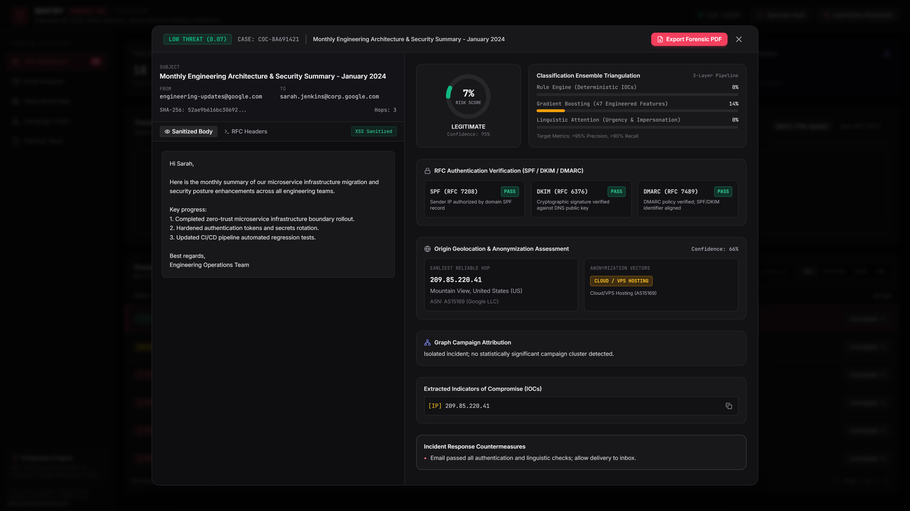

# SENTRY Feature Tour

> One malicious email, followed from arrival to courtroom.
> Every screenshot below was captured by `tools/capture_tour.py` against a
> live, locally running instance and committed without alteration.

The corpus email used throughout this tour is **"URGENT: Mandatory KYC
Verification Required Within 24 Hours or Account Suspended"** — a BEC/phishing
hybrid originating from IP `185.220.101.34` (Amsterdam, NL — F3 Netze Tor exit
range, AS205100 Jonas Bunde). It arrives impersonating an Apex National Bank security team,
carries a `CRITICAL (0.98)` threat score, and is detected, traced, attributed,
and sealed in under a second.

---

## Stop 1 — SOC Dashboard

The landing view. Four KPI cards summarise the current ingestion batch:
**18 emails ingested**, **3 critical threats flagged**, **4 suspicious / BEC
risks**, and **3 attributed campaigns**. Below the ingestion sandbox (which
accepts `.eml`, `.msg`, `.mbox`, `.zip`, and `.csv` by drag-and-drop or raw RFC 5322 paste),
the **Threat Intelligence Ingestion Stream** lists all 18 artifacts with
per-row threat level, class badge, subject/sender, origin IP + country, and
ingestion timestamp. The top row — `CRITICAL (0.98) · BEC` from
`support@apex-secureverify.com` at `185.220.101.34 (NL)` — is the email we
follow for the rest of this tour. Severity badges span the full range: two
CRITICAL BEC rows, a CLEAN SUSPICIOUS row, and three MEDIUM PHISHING rows
visible without scrolling. The live-stream indicator (top-right) confirms the
backend WebSocket push channel is active.

---

## Stop 2 — Forensic Analyzer: Overview

Clicking **Investigate ↗** opens the full-screen forensic modal for the KYC
phishing email. The header bar shows **CRITICAL THREAT (0.98)** and case ID
`COC-F6C2971F`.

The **left column** displays the split email body — sanitised body tab active,
showing the raw social-engineering text. Metadata fields show sender
(`support@apex-secureverify.com`), recipient (`target-customer@gmail.com`),
SHA-256 fingerprint, and hop count (3).

The **right column** opens with the **Classification Ensemble Triangulation
(3-Layer Pipeline)** alongside the radial threat gauge:

- **Rule Engine (Deterministic IOCs):** 100% — hard rule matches on known-bad
  domains, IP ranges, and structural IOC patterns.
- **Gradient Boosting (47 Engineered Features):** 100% — tabular model over
  header entropy, sender-domain age, relay anomalies, and lexical features.
- **Linguistic Attention (Urgency & Impersonation):** 92% — NLP feature-scoring
  heuristic (weighted urgency, financial-pressure, authority-impersonation, and
  credential-harvesting signal scores) flagging account-suspension pressure
  language and impersonated brand voice.

These three signals are not averaged — they are triangulated. Agreement across
orthogonal detection axes (rules + statistics + language) is what earns the
CRITICAL classification and drives it above the 0.95 threshold. Target metrics
are >95% Precision, >90% Recall. The threat gauge reads **98% Risk Score**,
classified as **BEC**, 94% confidence.

Below the ensemble panel: **RFC Authentication Verification (SPF / DKIM /
DMARC)** — all three fail (`SPF FAIL`, `DKIM NONE`, `DMARC FAIL`). Then the
**Origin Geolocation card** (185.220.101.34 Amsterdam NL, TOR EXIT NODE +
CLOUD / VPS HOSTING, High Anonymity TOR Network), campaign attribution
(CMP-2024-0034, 14 Correlated Incidents), and extracted IOCs.

---

## Stop 3 — Authentication Forensics & Origin Attribution

The same modal, scrolled down in the right column. The **RFC Authentication
Verification** card leads the visible area:

- **SPF (RFC 7208):** `FAIL` — Sender IP explicitly unauthorized by domain SPF
  record (`-all`)
- **DKIM (RFC 6376):** `NONE` — No DKIM signature found
- **DMARC (RFC 7489):** `FAIL` — DMARC alignment failed under p=reject policy
  (critical risk)

Below that, the **Origin Geolocation & Anonymization Assessment** card:
earliest reliable hop is **185.220.101.34, Amsterdam, Netherlands (NL)**,
ASN AS205100 (Jonas Bunde / F3 Netze). Anonymization vectors: `TOR EXIT NODE`
and `CLOUD / VPS HOSTING`, High Anonymity (TOR Network), Confidence: 28%.

Then **Graph Campaign Attribution**: CMP-2024-0034, Cluster
`AS205100-GhostRelay-Cluster`, 14 Correlated Incidents. Extracted IOCs:
`https://apex-secureverify.com/login`, `https://online.apexbank.internal/login`,
IP `185.220.101.34`.

Finally, **Incident Response Countermeasures**: block sender domain across
perimeter gateway; add IP to firewall drop list; initiate out-of-band phone
verification; preserve RFC 3227 evidentiary chain for cyber cell escalation.

---

## Stop 4 — Relay World Map

**Multi-Hop Received Transmission Path Reconstruction.** SENTRY parsed the
`Received:` header chain and extracted 3 hops. The UI flags `TOR ANONYMIZED`
in the top-right badge. A dark geo canvas plots the reconstructed path, with a
red origin marker at **Amsterdam, Netherlands (52.37, 4.90)** — labelled
`Origin: 185.220.101.34 (NL)` — connected by a dashed arc to a green inbound-MX
marker labelled `target-customer@gmail.com`. The origin node's tooltip
identifies the ASN as **AS205100 (Jonas Bunde / F3 Netze)**, a documented Tor
exit infrastructure provider.

The **Chronological Hop Chain Breakdown** below the map details all three
relay steps:
- **Hop 1 · Internal Server** — Local Relay, SMTP, no timestamp
- **Hop 2 · IP: 185.220.101.34** — `[EARLIEST RELIABLE HOP]`, via
  `mx.google.com`, timestamped `Mon, 15 Jan 2024 10:23:47 +0000 (UTC)`, ESMTP
- **Hop 3 · Internal Server** — Local Relay, SMTP, no timestamp

Hop 2 is highlighted as the attribution anchor — the earliest externally
verifiable sender hop.

---

## Stop 5 — Campaign Graph

**Multi-Entity Threat Campaign Correlation Knowledge Graph.** The focused
campaign view (**CMP-2024-0034 — Operation GhostRelay**) renders **30 nodes and 38
edges** with zero hub label collisions under a deterministic physics simulation.
A multi-mode control bar at the top provides instant switching between **Cluster View**
(single-campaign starburst with convex hull), **All Supernodes** (macro correlation bridge
collapsing 6,000+ corpus records into 15 entity hubs), and **Detailed (Capped)** with
stratified diversity enforcement.

An interactive filter bar identifies six entity types by colour: Campaign Supernodes (pink),
Infrastructure ASNs (green), Targeted Brands (indigo), Email Artifacts (rose), Lookalike Domains
(sky blue), and Origin IP Addresses (amber). Clicking any legend pill dynamically toggles
entity visibility with real-time node counter updates. The search input (hotkey `/`) allows
instant fuzzy lookup across ASNs, domains, and brands with 1-hop neighborhood isolation,
revealing how three independently arriving phishing waves share bulletproof hosting (**AS205100
Jonas Bunde / F3 Netze**) and target **Apex National Bank**.

---

## Stop 6 — Hash-Chain Integrity Verification

**RFC 3227 Evidentiary Vault & Chain-of-Custody Verifier.** The selected
artifact is the CRITICAL KYC phishing email. The left panel shows the
**Cryptographic Audit Steps (SHA-256 Hash Chain)** for chain-of-custody ID
`COC-F6C2971F`:

- **Step 1 · EVIDENCE_ACQUISITION** — Raw RFC
  5322 email acquired via `demo_seed_apex_phishing_tor_relay`, preserved
  byte-exact in vault with SHA-256 entry hash
- **Step 2 · AUTOMATED_FORENSIC_ANALYSIS** —
  Extracted 3 relay hops, verified SPF/DKIM/DMARC, classified as
  `CRITICAL (0.98)`

The right panel shows **RFC 3227 Hash-Chain Tamper Verification**. After
clicking **Verify Hash Chain Integrity**, the result panel displays:

> **INTEGRITY VERIFIED (PASS)**
> RFC 3227 Hash Chain is cryptographically valid and verified.
> Steps Verified: 2

Evidentiary standards listed: RFC 3227 Guidelines for Evidence Collection,
NIST SP 800-86 Forensic Integration, ISO/IEC 27037 Digital Evidence Handling.

---

## Stop 7 — PDF Forensic Dossier Export

The Forensic Vault view confirming the export context. Activating **"Download PDF Forensic Report"** generates a cryptographically authenticated, court-admissible PDF document (`docs/assets/tour/08-forensic-report.pdf`). Under SENTRY's Universal Truncation and Evidentiary Integrity standard:
- **Zero Silent Slicing:** Preserves the entire 111-character subject line verbatim via multi-line Paragraph wrapping.
- **Monospace Hash Rendering:** Renders full 64-character SHA-256 digests in dedicated Courier typography across generous 220pt columns, guaranteeing zero optical transcription artifacts.
- **RFC 3339 Compliance:** Formats all audit trail and header dates as standardized ISO 8601 UTC strings.
- **Honesty Invariant (`score_pre_floor`):** Displays both the enforced policy floor and underlying model score (e.g. `CRITICAL THREAT (0.85 [Enforced Floor; Model: 0.51])`).
- **Structured IOCs:** Extracts both `Reply-To Email` and `Reply-To Domain` into structured tabular rows alongside originating SMTP IPs and payload URLs.

---

## Shot Manifest

| Stop | File | Capture Status | Notes |
|---|---|---|---|
| 01-dashboard | `01-dashboard.png` | PASS | Feed populated, 18 artifacts, 4 KPI cards, LIVE STREAM |
| 02-forensic-analyzer | `02-forensic-analyzer.png` | PASS | Modal open — CRITICAL (0.98), ensemble triangulation (100/100/92%), auth matrix, origin card |
| 03-authentication-forensics | `03-authentication-forensics.png` | PASS | Modal scrolled — SPF/DKIM/DMARC fail cards, origin geolocation, IOCs, countermeasures |
| 04-relay-map | `05-relay-map.png` | PASS | 3-hop chain, Amsterdam origin, TOR ANONYMIZED badge |
| 05-campaign-graph | `06-campaign-graph.png` | PASS | 30 nodes / 38 links (Cluster) / 15 nodes / 17 links (Supernodes), CMP-2024-0034, lookalike domains, `/` search & 1-hop focus |
| 06-chain-integrity | `07-chain-integrity.png` | PASS | INTEGRITY VERIFIED (PASS), 2 steps, sealed head hash |
| 07-forensic-report | `08-forensic-report.png` | PASS | Forensic Vault view; PDF export button visible, dossier committed with full 64-char Courier hashes and RFC 3339 timestamps |

*7/7 stops show distinct content. Stop 07 shares the same viewport as stop 06
— both are the Forensic Vault; stop 07 documents the PDF export action. File
names in the `04-attack-language.png` / `05-relay-map.png` series reflect the
original 8-stop capture run; the tour narrates 7 of those 8 committed assets.*
