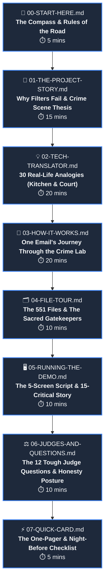

# 🧭 00 — START HERE: The SENTRY Onboarding Compass

Welcome to **SENTRY**. If you are reading this, you are likely joining the team as a presenter, domain researcher, legal analyst, or teammate with zero computer science or IT background. 

**This guide was built specifically for you.**

You do not need to know how to write code, configure servers, or build neural networks. Your job is to understand the human problem SENTRY solves, how it thinks like a forensic detective, why its evidence stands up in court, and how to speak with absolute clarity and conviction when presenting to judges, clients, or evaluators.

---

## 🗺️ The Learning Map: 8 Stations in 90 Minutes

The curriculum is structured as eight connected stations. Each document builds on the previous one without skipping steps or assuming prior knowledge.

---

## ⏱️ Choose Your Path: Full Mastery vs. The 15-Minute Fast Track

Depending on how much time you have before your demo or review, choose between two structured paths:

### 🏆 The 90-Minute Master Path (Full Curriculum: 00 &rarr; 07)
* **Goal:** Understand the system completely, walk through live screens with confidence, and survive aggressive technical cross-examination from evaluators.
* **Who it is for:** Anyone who will speak during judging, answer audience questions, or explain why SENTRY makes specific technical decisions.
* **Outcome:** You will understand why SENTRY rejects self-spoofing domains, why its tamper-evident hash chains are court-admissible, and why it publishes its mistakes in an errata log.

---

### ⚡ The 15-Minute Crash Path (01 &rarr; 05 &rarr; 07)
* **Goal:** Learn what the product does, which buttons to click, and what words to say at each screen.
* **Who it is for:** A teammate who needs to operate the presentation clicker or drive the live mouse on short notice.
* **Sequence:** [01-THE-PROJECT-STORY.md](01-THE-PROJECT-STORY.md) &rarr; [05-RUNNING-THE-DEMO.md](05-RUNNING-THE-DEMO.md) &rarr; [07-QUICK-CARD.md](07-QUICK-CARD.md).

> [!WARNING]
> ### ⚠️ The 15-Minute Trade-Off: Honest Calibration
> The 15-minute crash path produces a presenter who can **walk the screens**, not one who can **survive judge Q&A**. 
> 
> * **What the fast track gives you:** The physical demo choreography, what to click, and the plain-English script for all 5 screens.
> * **What the fast track skips:** The cryptographic underpinnings (SPF/DKIM/DMARC in Station 02), the 5-stage lab pipeline (Station 03), the repository file tour (Station 04), and the defense armor against judge skepticism (Station 06).
> 
> **Never enter an evaluator Q&A session having only completed the fast track.** If an evaluator asks, *"How does your graph clustering prevent visual overlap?"* or *"Why didn't your model flag this internal newsletter?"*, only the 90-minute path gives you the receipts to answer with absolute authority.

---

## 🎨 The Fixed Icon Set

Throughout every document in this series, icons have exact, unvarying meanings:

| Icon | Name | Meaning & Reader Expectation |
|:---:|---|---|
| 📌 | **Facts Citation** | A quantitative metric derived live from machine execution against [`docs/PROJECT_FACTS.md`](../PROJECT_FACTS.md). Never invented. |
| 💡 | **Everyday Analogy** | A real-world parallel (kitchens, passports, crime scenes) explaining a concept before any technical term is used. |
| 🔍 | **Concept Deep Dive** | The plain-English definition explaining the technical mechanism without academic jargon. |
| ⚖️ | **Forensic Rigor / Law** | Legal admissibility standards (RFC 3227), court-ready rules, or repository operating laws. |
| 🛠️ | **In the Project** | Where and how SENTRY actually implements this concept in code, files, or user interface components. |
| ⚠️ | **Honest Limitation / Warning** | What SENTRY does *not* do, edge cases where it intentionally steps back, or common traps presenters fall into. |
| 🎯 | **Checkpoint & Memory Hook** | A fast self-test question or memorable one-liner to lock the concept into permanent recall. |
| 🧠 | **Judge & Evaluator Mindset** | What evaluators and judges are secretly thinking when they look at this feature, and how to satisfy their scrutiny. |
| 🚪 | **Station Exit / Navigation** | The bridge leading you cleanly into the next station of the learning path. |

---

## 📜 The Three Rules of This Guide

1. **Audience Calibration Law (O-1):** You will never encounter a technical term without an everyday analogy and a plain-English definition introducing it first. If you spot a technical buzzword that was not explained, that is a defect in the documentation, not a failing in you.
2. **Facts Law (O-2):** Every single number in this guide is derived directly from automated machine tests. SENTRY never rounds up, exaggerates, or invents statistics. Every verified number carries the 📌 badge.
3. **Honesty Law (O-3):** We show our system's boundaries proudly. When SENTRY cannot determine an email's origin, it outputs `UNKNOWN` rather than guessing. When we make mistakes, we document them publicly in [`evaluation/ERRATA.md`](../../evaluation/ERRATA.md). Evaluators trust teams that know their limits.

---

## 📌 Ground-Truth System Baseline (Version 1.2.2)

Every number you will memorize and speak during presentations is anchored to the machine-verified ledger in [`docs/PROJECT_FACTS.md`](../PROJECT_FACTS.md):

* 📌 **App Version:** `1.2.2` (unified across Python backend, React frontend, and Git release tag `v1.2.2`).
* 📌 **Automated Pytest Suite:** `164 tests` across 26 test modules in `backend/tests/` (100% passing).
* 📌 **Golden Verification Gates:** `21 gates` executed by `tools/verify_sentry.py` covering end-to-end UI, API, and WebSocket flows.
* 📌 **Master Defect Ledger:** `78 total defects` tracked in `evaluation/defects.json` (68 resolved, 1 interim-mitigated, 3 consolidated, 1 deferred, 5 open).
* 📌 **Registered API Endpoints:** `29 total routes` (24 business DFIR routes + 5 system routes).
* 📌 **Legitimate Email Benchmark Corpus:** `6,777 unique legitimate emails` (6,951 files) processed with `0 false positive elevations` (0.0% FP rate).
* 📌 **Live Demo Corpus:** `18 seed emails` pre-loaded in the demonstration database (15 Critical, 1 Medium, 2 Low).
* 📌 **Repository Tracked Files:** `551 files` tracked in Git across all subsystems.

---

## 🚪 Station Checkpoint & Next Step

Before moving forward, verify that you have chosen your path:
* If you have 90 minutes: proceed to [01-THE-PROJECT-STORY.md](01-THE-PROJECT-STORY.md).
* If you are on the 15-minute emergency fast track: proceed to [01-THE-PROJECT-STORY.md](01-THE-PROJECT-STORY.md), then skip to [05-RUNNING-THE-DEMO.md](05-RUNNING-THE-DEMO.md).

Proceed to: **[Station 01 — THE PROJECT STORY: Why Filters Fail & The Crime Scene Thesis &rarr;](01-THE-PROJECT-STORY.md)**
