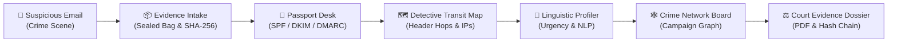

# 🔬 03 — HOW IT WORKS: One Email's Journey Through the Crime Lab

> *Station 03 will trace the journey of one suspicious email through SENTRY's forensic pipeline: from the initial intake desk and tamper-evident sealing, to the three examination stations (rules, statistics, and language), to origin tracing and campaign graph correlation.*

*(Authoring scheduled for Phase 2: Level 2/3 Documents)*

---

## 🗺️ The Crime Lab Pipeline Overview (Conceptual)

---

*Continue to previous station: [02-TECH-TRANSLATOR.md](02-TECH-TRANSLATOR.md)*  
*Continue to next station: [04-FILE-TOUR.md](04-FILE-TOUR.md)*
