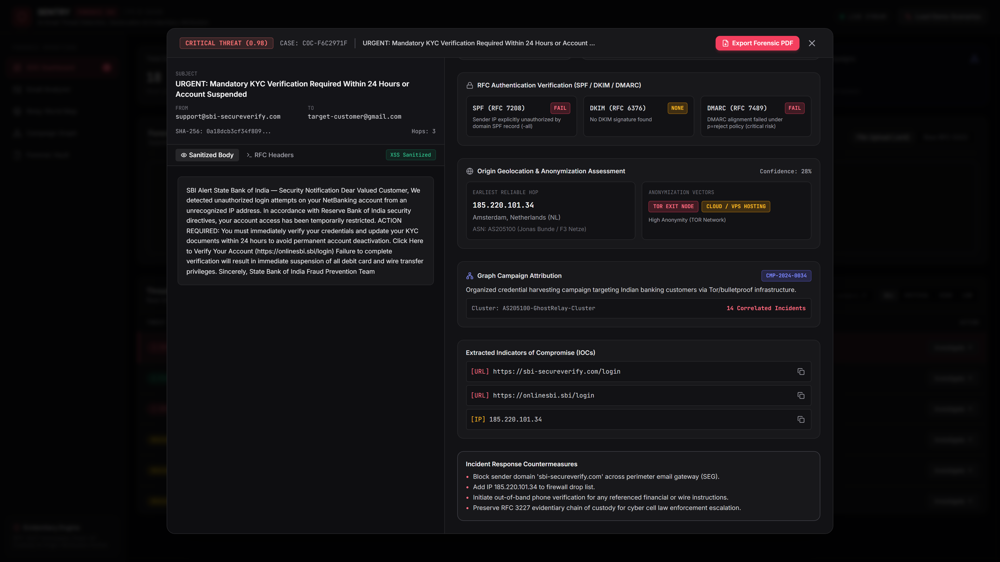
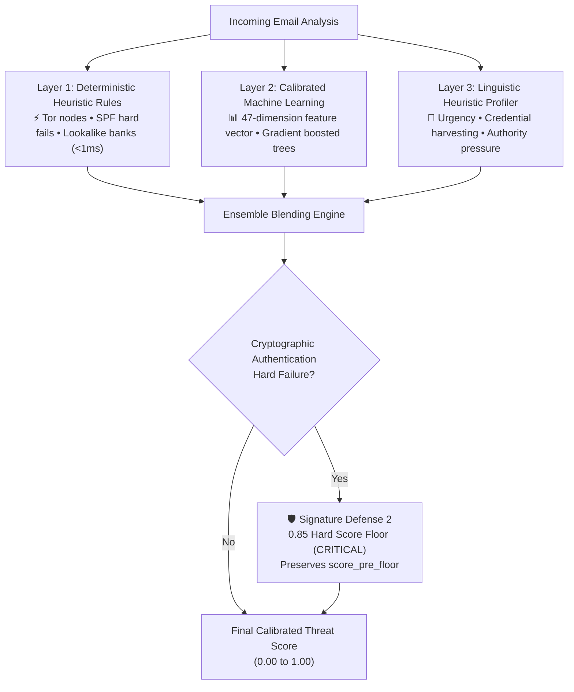
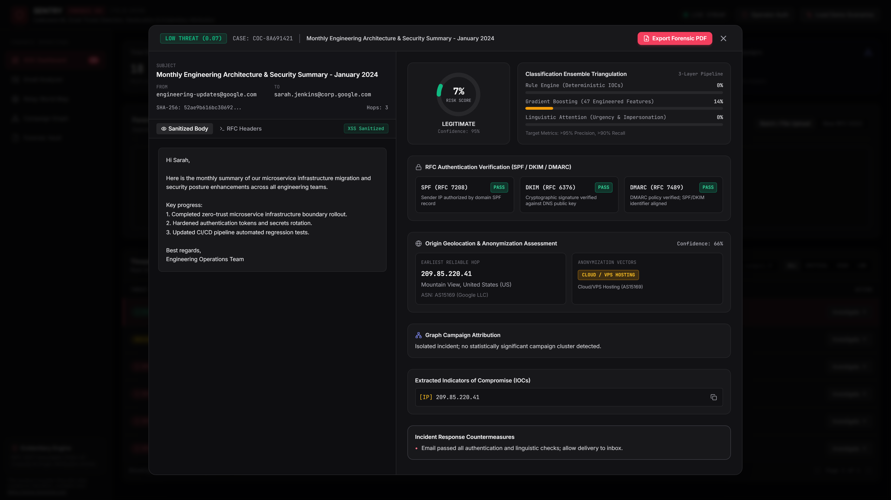

# 🔬 03 — HOW IT WORKS: One Email's Journey Through the Forensic Crime Lab

> *"When a suspicious message arrives, SENTRY does not make a snap decision. It guides the message through a six-station forensic crime laboratory: sealing the digital evidence, checking its international passports, tracing its hidden postal transit route, analyzing its psychological manipulation, mapping its criminal network connections, and generating a court-admissible evidence dossier."*

---

## 🗺️ The Crime Lab Pipeline Overview

Every single email entering SENTRY follows the exact same linear, tamper-evident pipeline:

```mermaid
flowchart TD
    subgraph S1["Station 1: Evidence Intake Desk"]
        A["📩 Raw Suspicious Email"] --> B["🔒 Sealed Evidence Vault<br/>Genesis SHA-256 Digest (H₀)"]
        B --> C["🧼 Sanitized Visual View<br/>Active HTML Scripts Stripped"]
    end

    subgraph S2["Station 2: Passport & Border Control"]
        C --> D["🛂 Cryptographic Authentication<br/>SPF • DKIM • DMARC Matrix"]
        D --> E["🛡️ Signature Defense 1<br/>The Reserved-IP Bouncer"]
    end

    subgraph S3["Station 3: Detective's Transit Route"]
        E --> F["🗺️ Received: Header Chronology<br/>Earliest Reliable External Hop"]
        F --> G["📍 Offline Geolocation<br/>City, Country & ASN Mapping"]
    end

    subgraph S4["Station 4: Psychological Profiler"]
        G --> H["🧠 3-Layer Triangulated ML<br/>Heuristics + Gradient Boosted Trees + NLP"]
        H --> I["🛡️ Signature Defense 2<br/>The Honest 0.85 Score Floor"]
    end

    subgraph S5["Station 5: Crime Syndicate Pinboard"]
        I --> J["🕸️ Knowledge Graph Correlation<br/>Shared IPs, Domains & Targets"]
        J --> K["🛡️ Signature Defense 3<br/>The Self-Spoof Blacklist Refusal"]
    end

    subgraph S6["Station 6: Court Evidence Dossier"]
        K --> L["⚖️ RFC 3227 Hash Chain Verified<br/>Untampered Mathematical Audit"]
        L --> M["📄 Court-Admissible PDF Export<br/>4-Row IOC Table & Monospace Hashes"]
    end

    classDef stationBox fill:#0f172a,stroke:#3b82f6,stroke-width:2px,color:#f8fafc;
    class S1,S2,S3,S4,S5,S6 stationBox;
```

---

## Station 1: The Evidence Intake Desk & Digital Preservation

### 💡 The Story
When a police patrol officer collects a bloodstained knife at a crime scene, they do not wash it with soap, polish the handle, or test whether it can cut vegetables. 

They photograph the knife exactly as it lies, place it inside a heavy-duty, tamper-evident plastic evidence bag, seal the bag with a permanent adhesive strip, write the date and case number across the seam, and deposit it into the precinct's locked evidence locker.

### 🔍 The Concept: Bit-for-Bit Preservation
When an email arrives at SENTRY (via upload, copy-paste, CSV batch, or ZIP archive), SENTRY treats the raw data as immutable legal evidence:
1. **Raw Storage:** The original bytes are stored verbatim on disk in `evidence_vault/`.
2. **Genesis Hash ($H_0$):** SENTRY immediately calculates the cryptographic SHA-256 fingerprint of the raw data. This is the **Genesis Block ($H_0$)** of the email's life history. If even one space character in the file changes later, the fingerprint changes completely.
3. **Safety Wash (Sanitization):** Attackers often hide malicious code (like JavaScript or tracking pixels) inside email HTML to hack the investigator's own screen. SENTRY runs the message body through an aggressive digital disinfectant (`bleach`) that neutralizes active scripts while preserving the visible text exactly as the victim saw it.

*Live visual from `docs/assets/tour/07-chain-integrity.png`: Genesis SHA-256 block $H_0$ recorded, live mathematical chain status displaying `CHAIN VALID / UNTAMPERED`.*

### 🛠️ In the Project
* **Implementation:** [`backend/app/services/ingestion.py`](../../backend/app/services/ingestion.py)
* **Storage Location:** `evidence_vault/{email_id}.eml`
* **Test Protection:** [`backend/tests/test_ingestion.py`](../../backend/tests/test_ingestion.py) and [`backend/tests/test_content_analysis.py`](../../backend/tests/test_content_analysis.py)

> [!NOTE]
> ### ⚠️ Honest-Limitations Sidebar: Raw Preservation Means Raw Errors
> SENTRY **never** fixes syntax errors or repairs broken formatting in incoming emails. If a scammer writes a malformed header that violates internet standards (RFC 5322), SENTRY records the error verbatim as evidence of suspicious amateurism. A forensic tool that "fixes" files invalidates its own evidence in court.

---

## Station 2: Passport & Border Control (Authentication Forensics)

### 💡 The Story
Imagine an international traveler walking up to airport border control holding a passport that says "Kingdom of Spain."

The border officer performs three strict checks:
1. **The Authorized Flight Manifest (SPF):** The officer checks whether the airplane that brought the passenger was authorized to take off from Madrid.
2. **The Holographic Wax Seal (DKIM):** The officer inspects the official embossed seal on the visa page to confirm it hasn't been chemically erased and overwritten.
3. **The Government Rulebook (DMARC):** The officer consults the Kingdom of Spain's official instructions: *"If the flight manifest or the wax seal fails, detain the traveler immediately and notify our embassy."*

### 🔍 The Concept: SPF, DKIM, and DMARC
In email, any sender can type whatever name they want into the `From:` box—just like writing "From: The President" on the corner of a paper envelope. 

SENTRY's authentication station interrogates the cryptographic reality behind the envelope:
* **SPF (Sender Policy Framework):** Did the sending computer's IP address have official permission from the domain owner to send mail?
* **DKIM (DomainKeys Identified Mail):** Does the message carry an unforgeable digital signature signed with the sender's private cryptographic key?
* **DMARC:** What policy has the real domain owner published? (`reject`, `quarantine`, or `none`).

*Live visual from `docs/assets/tour/03-authentication-forensics.png`: SPF / DKIM / DMARC status badge matrix, authentication severity elevation, and origin geolocation.*

### 🛡️ Signature Defense 1: The Reserved-IP Bouncer
When scammers create fake emails to test corporate security, they often inject private, internal network addresses (such as `127.0.0.1`—the computer's internal loopback—or `10.0.0.0/8`, `192.168.0.0/16`, or documentation networks like `203.0.113.0/24` TEST-NET-3).

* **The Trap:** Basic tools look at the last hop in the header, see `127.0.0.1`, and declare: *"This email came from inside your own office!"*
* **The SENTRY Bouncer:** SENTRY's `GeoOriginService` contains a strict guard recognizing **22 distinct RFC special-use and private network ranges**. When SENTRY traces an email, it automatically identifies and skips these unroutable internal hops, refusing to stop until it isolates the **first externally-routable gateway on the public internet**.

### 🛠️ In the Project
* **Implementation:** [`backend/app/services/header_forensics.py`](../../backend/app/services/header_forensics.py) (`HeaderForensicsService.extract_earliest_reliable_hop`)
* **Test Protection:** [`backend/tests/test_header_forensics.py`](../../backend/tests/test_header_forensics.py) and [`backend/tests/test_master_verification_email.py`](../../backend/tests/test_master_verification_email.py) (Defect `DEF-A` guard)

> [!NOTE]
> ### ⚠️ Honest-Limitations Sidebar: Missing Passports
> If an email was created locally inside a private network or pasted as plain text without any transit headers, SENTRY does not guess where it came from. It outputs `UNKNOWN (No Received Headers)` with a confidence score of `0.0`. Honest detectives admit when a trail has no footprints.

---

## Station 3: The Detective's Transit Route & Geography

### 💡 The Story
When a physical package is shipped from London to Tokyo, every sorting warehouse along the route slaps a postmark sticker onto the box:
* Stamped at Heathrow Airport, London (Monday 08:00)
* Stamped at Dubai Logistics Hub (Tuesday 02:00)
* Stamped at Narita Cargo Terminal, Tokyo (Wednesday 11:00)

By reading these stamps **from bottom to top**, a postal inspector can retrace the exact physical journey of the package, regardless of what return address is written on the front.

### 🔍 The Concept: The `Received:` Header Chain
Every time an email moves across the internet, the receiving computer stamps a hidden line at the top of the message called a `Received:` header. 

Because each new computer adds its stamp above the previous one, the history reads like an archaeological dig:
* **The Top Stamp:** The final destination computer (your company's mail server).
* **The Intermediate Stamps:** Mail transfer relays that forwarded the message along the way.
* **The Bottom Stamp:** The original computer where the message entered the public internet.

SENTRY parses these stamps, extracts the IP addresses, and plots them onto an interactive geographical map using a completely local, offline geolocation atlas (MaxMind GeoLite2).

*Live visual from `docs/assets/tour/05-relay-map.png`: Multi-hop transmission route plotted across the globe, highlighting the true originating infrastructure.*

### 🛠️ In the Project
* **Implementation:** [`backend/app/services/geo_origin.py`](../../backend/app/services/geo_origin.py)
* **Frontend Visualization:** [`frontend/src/components/map/OriginRelayMap.tsx`](../../frontend/src/components/map/OriginRelayMap.tsx)
* **Test Protection:** [`backend/tests/test_geo_origin.py`](../../backend/tests/test_geo_origin.py) (28 tests verifying special-use subnets, Tor exit nodes, and VPN flags)

---

## Station 4: The Psychological Profiler & 3-Layer Machine Learning

### 💡 The Story
A con artist rarely writes an email saying, *"Hello, I am a criminal and I am trying to rob you."*

Instead, they use subtle psychological pressure tactics:
* **Artificial Urgency:** *"Your account will be suspended within 2 hours!"*
* **Authority Impersonation:** *"Per order of the Executive Committee, wire these funds immediately."*
* **Greed & Secrecy:** *"A foreign inheritance of $14.5 million requires your urgent, confidential assistance."*

### 🔍 The Concept: Triangulated 3-Layer Analysis
SENTRY does not rely on a single, fallible artificial intelligence model. It uses a **3-Layer Ensemble** that combines human expert rules, statistics, and linguistic profiling:

1. **Layer 1 (Expert Rules):** Instant checks written by cybersecurity experts. If an email comes directly from a known Tor anonymous exit node or uses a lookalike banking domain (like `apex-secur1ty.com`), it is caught in under 1 millisecond.
2. **Layer 2 (Statistical Pattern Engine):** A machine learning model trained on 📌 `15,240 historical benchmark emails` evaluating 📌 `47 distinct dimensions` (header anomalies, URL formats, punctuation distribution, and structural tags).
3. **Layer 3 (Linguistic Heuristic Profiler):** An offline text analysis engine using calibrated linguistic heuristic scoring to measure urgency cues, credential theft prompts, and financial pressure keywords without neural runtime dependencies.

*Live visual from `docs/assets/tour/04-attack-language.png`: Linguistic radar chart showing urgency, credential theft cues, and statistical feature distribution.*

### 🛡️ Signature Defense 2: The Honest 0.85 Score Floor
What happens if a clever attacker writes an email with calm, friendly, polite language (so Layer 3 sees low urgency), but the email completely fails cryptographic authentication (it was proven to be forged)?

* **The Danger:** A naive machine learning model might average the numbers and give the email a low threat score (e.g., `0.35 - LOW`), letting a deadly spear-phishing attack land in an executive's inbox.
* **The SENTRY Policy Floor:** SENTRY enforces a strict rule: **If cryptographic authentication hard-fails, the email's threat score is automatically elevated to at least 0.85 (CRITICAL).**
* **The Radical Honesty:** SENTRY does not overwrite history. In the database and on the report, it transparently records **both** numbers:
  * `score_pre_floor: 0.35` (what the statistical model originally calculated)
  * `threat_score: 0.85` (the elevated score enforced by security policy)
  * `elevation_reason: "Elevated from 0.35 to 0.85 by DMARC/SPF authentication failure policy floor"`

### 🛠️ In the Project
* **Implementation:** [`backend/app/ml/classifier.py`](../../backend/app/ml/classifier.py) (`HybridClassifier.predict`)
* **Test Protection:** [`backend/tests/test_ml_classifier.py`](../../backend/tests/test_ml_classifier.py) and [`backend/tests/test_model_metrics.py`](../../backend/tests/test_model_metrics.py)

> [!NOTE]
> ### ⚠️ Honest-Limitations Sidebar: Sub-Second Offline Scoring vs. Cloud LLMs
> SENTRY deliberately avoids massive external cloud neural networks for live threat scoring. Cloud models require constant internet connectivity, transmit sensitive corporate email text to third-party servers, and take several seconds per message. SENTRY uses lightweight gradient boosted decision trees and calibrated linguistic heuristic scoring that execute in **under 15 milliseconds** on standard laptop hardware with zero internet access.

---

## Station 5: The Crime Syndicate Pinboard (Knowledge Graph)

### 💡 The Story
In every detective movie, there is a scene where the lead investigator stands before a large cork bulletin board. 

Pinned to the board are photographs of five different bank robberies across the city. Red string connects a bank robbery in the north to a stolen getaway car in the south. Another piece of string connects the getaway car to a specific burner phone number. Suddenly, the detective steps back and realizes: *"These five robberies weren't isolated crimes. They are all being run by the same syndicate."*

### 🔍 The Concept: Campaign Correlation
Individual scam emails are cheap to generate; attackers can send 10,000 different messages in an hour. But physical **attack infrastructure**—domain registrations, hosting servers, IP addresses, and money-mule reply mailboxes—costs time and money to build.

SENTRY constructs a live **Multi-Entity Knowledge Graph**:
* **Nodes (The Pins):** Emails, Sending Domains, Origin IP Addresses, Network Autonomous Systems (ASNs), and Target Brands.
* **Edges (The Red String):** Relationships like `SENT_FROM`, `RESOLVES_TO`, `REPLIES_TO`, or `TARGETS`.

When multiple emails share the same infrastructure, SENTRY automatically clusters them into a single unified **Threat Campaign** (e.g., `CAMP-APEX-FIN-01`).

*Live visual from `docs/assets/tour/06-campaign-graph.png`: Interactive D3 graph canvas showing clustered campaign relationships, infrastructure supernodes, and Gate 21 spacing clearance.*

### 🛡️ Signature Defense 3: The Self-Spoof Blacklist Refusal
One of the most dangerous email attacks is **internal domain spoofing**. A scammer sends an email pretending to be the CEO (`ceo@apexbank.com`), sent to an accountant (`accountant@apexbank.com`), asking for an urgent invoice payment.

SENTRY's forensic engines immediately identify that the email is fraudulent.

* **The Disaster Trap:** Many commercial security tools have an automated feature that says: *"Whenever an email is marked CRITICAL, automatically add the sender's domain to the corporate firewall blocklist!"* If a security tool does this to a spoofed email, it will add `apexbank.com` to the firewall—**instantly shutting down all legitimate internal corporate email across the entire bank.**
* **The SENTRY Refusal:** SENTRY's countermeasure engine contains an unbreakable guard: **It checks whether the sender domain matches the organization's own protected domain.** If a spoof is detected, SENTRY raises the alarm on the specific email, extracts the attacker's real external IP address for blocking, but **strictly refuses** to blackhole the organization's own domain name.

### 🛠️ In the Project
* **Implementation:** [`backend/app/services/correlation_engine.py`](../../backend/app/services/correlation_engine.py) and [`backend/app/ml/classifier.py`](../../backend/app/ml/classifier.py)
* **Frontend Component:** [`frontend/src/components/graph/CampaignNetworkGraph.tsx`](../../frontend/src/components/graph/CampaignNetworkGraph.tsx)
* **Test Protection:** [`backend/tests/test_correlation_deep.py`](../../backend/tests/test_correlation_deep.py) and [`backend/tests/test_countermeasures_and_iocs.py`](../../backend/tests/test_countermeasures_and_iocs.py)

---

## Station 6: The Court-Admissible Dossier Export

### 💡 The Story
A detective can spend six months conducting a brilliant investigation, collecting fingerprint cards, wiretap recordings, and surveillance photos. But on the day of the trial, the detective cannot simply hand the judge a disorganized box of loose papers.

The detective must submit a bound, indexed **official case dossier**. The dossier must include full timestamps, photographic exhibits, a signed chain of custody proving evidence was never altered, and exact technical descriptions that any prosecutor can read into the court record.

### 🔍 The Concept: RFC 3227 Evidentiary Standards
SENTRY does not produce vague summaries. With a single click, it compiles a complete, court-ready PDF forensic report adhering to international digital evidence standards (RFC 3227):
1. **Courier Monospace Hashes:** All cryptographic SHA-256 fingerprints are rendered in fixed-width monospace font (`Courier`) to prevent line-wrapping or visual truncation in court exhibits.
2. **RFC 3339 Timestamps:** Every action is timestamped to the millisecond with unambiguous universal time zone notation (e.g., `2026-09-02T10:26:42Z`).
3. **The Standardized 4-Row IOC Table:** A dedicated Indicator of Compromise table that provides network defenders with the exact technical coordinates needed to update corporate firewalls.

| IOC Classification | Extracted Technical Artifact | Recommended Tactical Action |
|---|---|---|
| **Malicious Origin IP** | `203.0.113.9` (External Relay) | Block at edge border firewall / perimeter gateway |
| **Forged Sender Domain** | `apex-bank-security.com` | Sinkhole via internal corporate DNS server |
| **Trap Reply-To Address** | `claims-dept@offshore-payout.com` | Filter incoming mail server transport rules |
| **Trap Reply-To Domain** | `offshore-payout.com` | Add to global perimeter email gateway drop list |

*Live visual from `docs/assets/tour/08-forensic-report.png`: The court-ready PDF dossier layout featuring executive summary, monospace hashes, the 4-row IOC table, and countermeasure playbooks.*

### 🛠️ In the Project
* **Implementation:** [`backend/app/services/reporting.py`](../../backend/app/services/reporting.py)
* **Test Protection:** [`backend/tests/test_evidence_reporting.py`](../../backend/tests/test_evidence_reporting.py) and [`backend/tests/test_master_verification_email.py`](../../backend/tests/test_master_verification_email.py) (Defect `DEF-B` complete table verification)

---

## 🎯 Station Checkpoint: The Crime Lab Comprehension Test

Before proceeding to Station 04, ensure you can explain these key concepts:

1. **Why does SENTRY calculate a Genesis Hash ($H_0$) the instant an email arrives?**
   * *Answer:* To establish a mathematically verifiable cryptographic seal over the raw email bytes. Any subsequent alteration to the evidence will cause the hash verification to fail, alerting investigators and judges to tampering.
2. **What is SENTRY's "Reserved-IP Bouncer" (Defense 1), and what does it prevent?**
   * *Answer:* It recognizes 22 private and documentation IP subnets (like `127.0.0.1` or `203.0.113.0/24`) and refuses to let fake internal hops deceive the origin finder, scanning outward until it isolates the true external gateway.
3. **How does the "Honest Score Floor" (Defense 2) balance machine learning with policy?**
   * *Answer:* If cryptographic authentication hard-fails, SENTRY mandates a minimum threat score of 0.85 (CRITICAL) regardless of how calm the text sounds, but transparently preserves both the raw ML score (`score_pre_floor`) and the elevated policy score on the report.
4. **Why does SENTRY's countermeasure engine refuse to block spoofed internal domains (Defense 3)?**
   * *Answer:* Because blocking your own company's domain name at the firewall would trigger a self-inflicted denial-of-service, halting all legitimate corporate email. SENTRY blocks the attacker's real external IP address instead.
5. **What 4 rows are always present in SENTRY's court-admissible IOC table?**
   * *Answer:* (1) Malicious Origin IP, (2) Forged Sender Domain, (3) Trap Reply-To Address, and (4) Trap Reply-To Domain.

---

## 🚪 Station Exit & Next Step

Now that you have seen an email travel through the entire six-station crime lab, you are ready to explore the **physical blueprints of the software itself**—touring the 551 tracked files across all 11 rooms of the repository.

Proceed to: **[Station 04 — FILE TOUR: Walking the Rooms of the Repository &rarr;](04-FILE-TOUR.md)**
