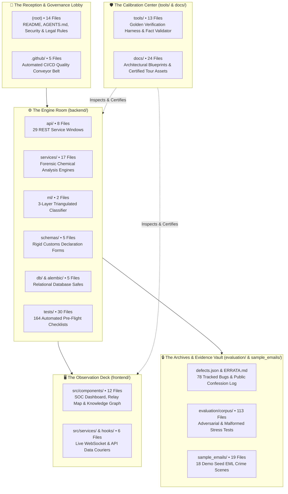

# 🗂️ 04 — FILE TOUR: Walking the Rooms of the Forensic Laboratory

> *"A software repository is not a random collection of computer code. It is an organized architectural building. Just like a physical forensic science institute has an intake lobby, chemical analysis laboratories, evidence vaults, and pre-trial briefing rooms, SENTRY's files are arranged into distinct, specialized rooms connected by clear doorways."*

---

## 🏛️ The Laboratory Floor Plan

To navigate SENTRY, picture the codebase as a high-security forensic institute:



---

## 📌 The 551-File Anchor & Dating Discipline

> [!IMPORTANT]
> ### 📌 The Certified Inventory Baseline
> As of release **v1.2.2** (commit `fb3fd64` / `3ca00ad`), the SENTRY repository tracks exactly 📌 **551 files** across 11 top-level directory groups, derived via the command:
> ```bash
> git ls-files | wc -l
> ```
> * **The Dating Discipline:** While authoring new educational documentation (such as this onboarding series) adds new files to the working directory, the certified release baseline stands permanently anchored at 551 tracked files. The numbers below represent the exact census of that certified release.

---

## 🌟 The Five Sacred Files: SENTRY's Cultural Guardians

In most software projects, all files are treated as replaceable code. In SENTRY, five files are treated as **sacred gatekeepers**. They protect the team from hallucination, sloppy claims, and hidden bugs.

### 1. `tools/verify_sentry.py` (The 21-Gate Golden Verification Harness)
* 💡 **Everyday Analogy:** The aerospace flight simulator and crash-test track that tests an airplane before it is certified to carry passengers.
* 🔍 **What It Does:** It boots the backend server on port 8000, boots the frontend on port 3000, connects an automated browser using Playwright, and methodically executes exactly 📌 **21 operational gates**—testing everything from raw email upload and WebSocket feeds to campaign graph force physics and single-origin static security.
* ⚖️ **Why the Team Treats It as Sacred:** **The Prime Directive of SENTRY:** *Your memory is not truth. Port probes are not truth. The verification harness is the sole source of truth.* After every single change, developers run this harness before drawing any conclusion.

---

### 2. `tools/validate_facts.py` (The Machine Fact & Integrity Validator)
* 💡 **Everyday Analogy:** A certified public accountant who audits every line of a company's financial report, verifying bank statements against receipts and rejecting the document if even one cent is unaccounted for.
* 🔍 **What It Does:** It dynamically counts tests in `backend/tests/`, gates in `verify_sentry.py`, defect objects in `defects.json`, API endpoints in FastAPI, and release tags in Git. It compares the live numbers against [`docs/PROJECT_FACTS.md`](../PROJECT_FACTS.md), audits every markdown link for dead references, and fails with a loud red banner if a single number drifts.
* ⚖️ **Why the Team Treats It as Sacred:** It enforces **Law A (Claim-Derivation Law)**. In SENTRY, humans are forbidden from typing numbers from memory. If a presenter says *"We have 164 tests,"* it is because `validate_facts.py` proved it five seconds ago.

---

### 3. `tools/capture_tour.py` (The Automated Tour Screenshot Capturer)
* 💡 **Everyday Analogy:** A court photographer who takes official evidentiary photos of a crime scene using calibrated, timestamped digital film with zero retouching, airbrushing, or filters allowed.
* 🔍 **What It Does:** It boots SENTRY in headless mode, navigates through all 8 core analyst workflows, waits for network requests and animations to stabilize, and captures pixel-perfect PNG screenshots directly into `docs/assets/tour/`.
* ⚖️ **Why the Team Treats It as Sacred:** It enforces the **Caption Honesty & Pixel Fidelity Law**. In SENTRY, documentation is never illustrated with Figma mockups, artistic drawings, or obsolete screenshots. Every image in our guides reflects the real, living pixels of the certified code.

---

### 4. `docs/PROJECT_FACTS.md` (The Sole Numeric Source of Truth)
* 💡 **Everyday Analogy:** The official Bureau of Weights and Measures prototype kilogram locked beneath three glass bell jars in Paris.
* 🔍 **What It Does:** It is the single centralized ledger containing every quantitative claim about the project: test counts, gate counts, defect counts, ham corpus benchmarks, and software versions.
* ⚖️ **Why the Team Treats It as Sacred:** It eliminates conflicting claims across team members. Presenters, engineers, and technical writers cite only this file. If a number is not in `PROJECT_FACTS.md`, it does not exist.

---

### 5. `evaluation/ERRATA.md` (The Permanent Engineering Confession Ledger)
* 💡 **Everyday Analogy:** A hospital's official morbidity and mortality register where surgeons meet weekly to analyze every complication, publish what went wrong, and design new checklists so the mistake is never repeated.
* 🔍 **What It Does:** It is an immutable, chronological archive documenting all 11 formal engineering errata discovered across the project's history—from route aggregation arithmetic anomalies to loopback hop-selection edge cases.
* ⚖️ **Why the Team Treats It as Sacred:** It embodies SENTRY's **Radical Honesty**. When evaluators ask, *"What mistakes did you make?"*, ordinary teams get defensive. SENTRY presenters open `ERRATA.md` and show the exact bug, the root cause, and the permanent test that was written to ensure it can never happen again.

---

## 🚪 Room-by-Room Inventory

### Room 1: The Reception Lobby (`(root)` • 14 Files)
The root directory houses governance, legal licenses, and deployment blueprints:

| Filename | Plain-English Purpose | Why It Matters |
|---|---|---|
| [`AGENTS.md`](../../AGENTS.md) | The constitution governing AI and human contributors. | Mandates the Prime Directive, the One-Port Policy, and the 6 Machine Operating Laws. |
| [`README.md`](../../README.md) | The front door of the project for outside developers. | Introduces the project thesis, architecture diagrams, and quickstart commands. |
| [`SECURITY.md`](../../SECURITY.md) | Cryptographic standards and vulnerability reporting rules. | Outlines our RFC 3227 chain of custody and reporting guidelines. |
| [`CONTRIBUTING.md`](../../CONTRIBUTING.md) | Step-by-step instructions for human engineers. | Establishes the protected-branch protocol: all work lands via pull requests. |
| [`CHANGELOG.md`](../../CHANGELOG.md) | Chronological record of all released versions. | Documents releases v1.1.0, v1.2.0, v1.2.1, and v1.2.2 under Law D (Immutable History). |
| [`DEPLOYMENT.md`](../../DEPLOYMENT.md) | Enterprise deployment guide for on-premises servers. | Covers air-gapped container boots, systemd services, and resource limits. |
| [`DILIGENCE.md`](../../DILIGENCE.md) | Master audit trail of every engineering milestone. | Contains the complete historical receipts verified across 50 audit reviews. |
| [`docker-compose.yml`](../../docker-compose.yml) | Multi-container orchestration blueprint. | Spins up backend, frontend, and database with a single command. |
| `Makefile` | Command-line shortcuts for common tasks. | Provides shortcuts like `make verify`, `make test`, and `make clean`. |
| `LICENSE` | Formal Apache 2.0 open-source software license. | Grants users legal permission to inspect, run, and adapt the software. |
| `.env.example` | Template for environment configuration settings. | Shows required settings (secret keys, port numbers) with safe defaults. |
| `.gitignore` | List of temporary files Git should never track. | Keeps scratch databases and cache folders from polluting the repository. |
| `.dockerignore` | List of local files excluded from container builds. | Ensures local logs and virtual environments do not bloat container images. |
| `verification_report.json` | The most recent local verification harness output. | Machine-readable receipt showing which gates passed during the last run. |

---

### Room 2: The Calibration Center (`tools/` • 13 Files)
The testing, validation, and maintenance toolkit:

| Tool Filename | What It Does in Plain English | Primary Execution Command |
|---|---|---|
| [`tools/verify_sentry.py`](../../tools/verify_sentry.py) | Executes all 21 operational gates using Playwright. | `python tools/verify_sentry.py --start` |
| [`tools/validate_facts.py`](../../tools/validate_facts.py) | Audits all numbers and links against PROJECT_FACTS.md. | `python tools/validate_facts.py --strict-links` |
| [`tools/capture_tour.py`](../../tools/capture_tour.py) | Captures 8 pixel-perfect PNG tour screenshots. | `python tools/capture_tour.py` |
| [`tools/demo_day.ps1`](../../tools/demo_day.ps1) | The "Big Green Button": one-command automated demo boot. | `powershell -File tools/demo_day.ps1` |
| [`tools/cleanup.ps1`](../../tools/cleanup.ps1) | Frees ports 8000 and 3000, terminating orphaned processes. | `powershell -File tools/cleanup.ps1` |
| `tools/backup_vault.py` | Creates a verified, compressed backup of `evidence_vault/`. | `python tools/backup_vault.py` |
| `tools/restore_vault.py` | Restores the evidence vault, verifying SHA-256 integrity. | `python tools/restore_vault.py` |
| `tools/benchmark_corpus_ingest.py` | Tests ingestion throughput against 6,777 legitimate emails. | `python tools/benchmark_corpus_ingest.py` |

---

### Room 3: The Engine Room (`backend/app/` • 41 Files)
The Python brain where forensic science and machine learning execute:

* **`api/v1/` (8 Files • 29 Registered Endpoints):**
  * `emails.py`: Handles email ingestion, threat listing, and individual inspection.
  * `dashboard.py`: Serves SOC metric summary cards and WebSocket live feeds.
  * `campaigns.py`: Delivers multi-entity graph nodes and edge relationships.
  * `auth.py`: Issues JWT authentication tokens and verifies user credentials.
  * `evidence.py`: Executes live mathematical hash chain audits for court exhibits.
* **`services/` (17 Files • Deep Forensic Engines):**
  * `header_forensics.py`: Reconstructs `Received:` header chronology; executes the Reserved-IP Bouncer.
  * `geo_origin.py`: Resolves IP addresses to physical cities using offline MaxMind databases.
  * `domain_intel.py`: Detects lookalike banking domains, Levenshtein typosquats, and Punycode.
  * `reporting.py`: Assembles court-admissible PDF dossiers with monospace Courier hashes and 4-row IOC tables.
  * `correlation.py`: Links isolated emails into unified campaigns based on shared infrastructure.
  * `countermeasures.py`: Generates firewall rules while enforcing the Self-Spoof Refusal.
* **`ml/` (2 Files • 3-Layer Triangulated Classifier):**
  * `classifier.py`: Implements the 3-Layer Ensemble and enforces the 0.85 Hard Score Floor.
  * `features.py`: Extracts the 47-dimension numerical feature vector from raw email text and headers.

---

### Room 4: The 164 Pre-Flight Checklists (`backend/tests/` • 26 Modules)
Every test module protects a specific system invariant, verified under Condition ON-1:

| Test Module File | Test Count | What It Protects from Regression |
|---|:---:|---|
| `test_geo_origin.py` | 28 | 22 RFC special-use network ranges, Tor nodes, VPN proxies. |
| `test_auth_surface.py` | 16 | Password hashing, token expiration, unauthorized write blocks (HTTP 401). |
| `test_batch_ingest.py` | 14 | ZIP archive unpacking, MBOX slicing, concurrent ingestion queues. |
| `test_api_endpoints.py` | 13 | Core REST endpoints, parameter validation, HTTP status codes. |
| `test_ml_classifier.py` | 13 | Ensemble blending, 0.85 score floor, model serialization. |
| `test_security_hardening.py` | 11 | Injection protection, path traversal guards, HTML sanitization. |
| `test_header_forensics.py` | 5 | Hop extraction order, missing header handling, authentication matrices. |
| `test_correlation_deep.py` | 5 | Knowledge graph edge construction, supernode clustering. |
| `test_master_verification_email.py` | 5 | Master verification EML, DEF-A hop selection, DEF-B IOC tables. |
| `test_version_legitimacy.py` | 3 | Version legitimacy gate, Git tag backing, unbacked mutation kills. |
| *16 Other Specialized Suites* | 51 | Backup, reporting, format integrity, domain intel, alerting, metrics. |
| **Total Test Battery** | **164** | **100% automated pass rate across all 26 modules.** |

---

### Room 5: The Observation Deck (`frontend/src/` • 18 Files)
The React/TypeScript single-page application where analysts investigate threats:

* `components/dashboard/`: Threat feed table, metric stat cards, category filter pills.
* `components/email-detail/`: Split-screen workbench (sanitized email on left, forensic tabs on right).
* `components/map/`: Leaflet-powered global hop relay map with custom SVG route pins.
* `components/graph/`: D3-powered force-directed campaign graph with node clustering and Gate 21 spacing.
* `components/report/`: Court-admissible PDF generation modal and previewer.
* `components/auth/`: Secure login dialog with JWT session management.

---

## 🎯 Station Checkpoint: The File Tour Recall Test

Before moving to Station 05, test your knowledge of the repository's rooms:

1. **Which file is SENTRY's "sole source of truth" for operational readiness?**
   * *Answer:* `tools/verify_sentry.py` (The 21-Gate Golden Verification Harness).
2. **Why does SENTRY keep an `evaluation/ERRATA.md` file?**
   * *Answer:* To practice radical engineering honesty by publicly documenting every technical mistake, its root cause, and the permanent test that prevents it from ever returning.
3. **What is the difference between `backend/app/services/` and `backend/app/api/`?**
   * *Answer:* `api/` provides the external doorways (endpoints) where requests enter; `services/` contains the internal forensic engines that do the heavy analysis work.
4. **How many test modules exist in `backend/tests/`, and how many tests do they run?**
   * *Answer:* Exactly 26 test modules executing 164 passing tests.
5. **How many total files were tracked in the repository as of release v1.2.2?**
   * *Answer:* Exactly 551 tracked files across 11 top-level directory groups.

---

## 🚪 Station Exit & Next Step

Now that you have walked through every room of the repository and know where every sacred file lives, you are ready to learn **how to run the live demonstration**—mastering the 5-screen presentation script and the famous story of the 15-Critical threat feed.

Proceed to: **[Station 05 — RUNNING THE DEMO: The 5-Screen Script & The 15-Critical Story &rarr;](05-RUNNING-THE-DEMO.md)**
